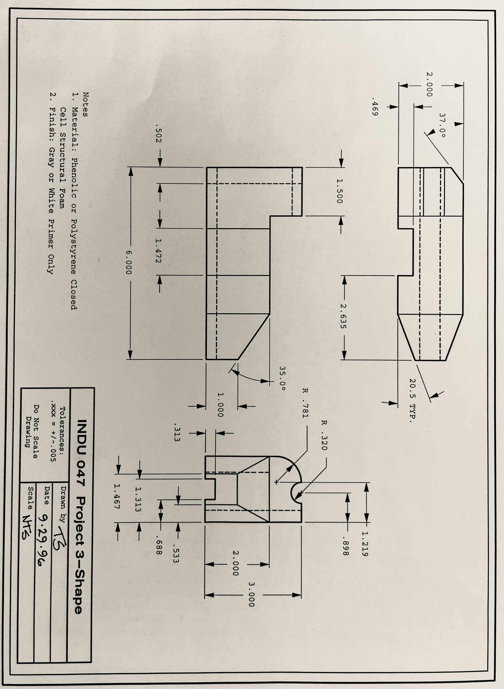

# Project 3: Shape

#### Brief 
Make the shape described by the accompanying drawing.  Finish it with primer.  Fidelity to the drawing should be a concern, however, your model will not be expected to interface with another part.

#### Goals
Discover for yourself some of the possibilities and limitations of modeling with structural foam. Practice creating three-dimensional reality from an orthogonal part drawing.

#### Materials 
You will be provided with a piece of phenolic or polystyrene foam from which to make your shape.  You will need to buy either white or gray primer to finish the model.

#### Format 
You are being asked to complete this project before you receive any formal instruction in how to work this kind of material.  Don’t be intimidated.  Remember, this project will not be graded and so all you really need to demonstrate is enthusiasm and effort.  This is a chance to improvise on what you know, invent solutions, and experiment.  Believe it or not, this is how most things are actually designed and built, at least the first time.   If you find yourself getting frustrated, try an altogether different approach.

#### Evaluation 
Other than the vendor list, this is your final ungraded project for this course.   Exploit this last opportunity.  Don’t worry so much about the result; try to really explore the process and understand the material. 

