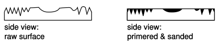

# Finishing Skills
This handout is focuses on painting plastic and foam, but explains a systematic approach to finishing which is relevant to other applications such as furniture or polishing metal.  I will discuss the necessary materials, move on to general issues, and then describe the specific steps in the process.  The emphasis of the method described is that finishing is a process of constructing a surface made of paint rather than simply painting the surface of your model.  

## Tools 
In general the tools for building a finish are abrasives, the finish itself, and an applicator.  In the particular case treated here these tools are manifest as sandpaper and compounds, paint, and a means for spraying it.

#### Sandpaper

Producing a smooth uniform surface requires a full range of sanding grits.  Prepare the surface with 180 or 220 grit.  Sand the primer with 400 and 600 grit.  Polish the color coat with 1000, 1200, and 1500.  The finer grit papers can be found in automotive paint stores.

Always wet sand paint.  You can work under a dripping faucet or keep a small bucket of water next to you.  Wash the sandpaper frequently to clear it of paint.  A wet surface can look more uniform than it actually is so frequently rinse your part and wipe it with a rag to judge your progress.  

#### Rubbing and Polishing Compounds  
For most model work the finest grit paper will produce a sufficient polish, but if you want the ultimate control over a surface you can use these compounds as the last step of the finishing process.  Compounds are made by suspending abrasive grit in a solvent base.  Rubbing compound is a coarser grit than polishing compound.  For the large surfaces found on a car compounds are used with power buffing and polishing equipment.  For models you will use a rag or even your fingers.  

With compounds you can polish areas that you can’t reach with paper.  You can also polish a particular part of the surface.  This means that if for whatever reason some part of the surface has more or less sheen than you would like you can change it without affecting the rest of the surface.  In this way you can fine tune the appearance of your model.    

One caveat, though: beware of silicates.  These abrasive are used in the less expensive compounds and even in trace amounts adversely affect the way paint dries.  What this means is that unless you are certain your compounds are silicate-free, don’t use them until after you have applied your last coat of paint.  

#### Paint

Use lacquer paint.  It dries quickly, sands well, is durable enough, and reasonably priced.  Urethane paint is tougher and has improved workability, but is considerably more expensive than lacquer.  Urethane paint is the superior material, but the extra expense is unwarranted for painting a model.  Enamel paint takes a long time to dry and should not be used.

You have two choices for buying your paint.  Aerosol cans of lacquer-based paint are available in large, chain-style auto parts stores and, to a certain extent, at hardware stores.  If youare not particular about the exact color this is an easy an inexpensive way to go. If, however, you want a particular color you will need to go to an automotive paint store and have them mix a custom color for you.  A pint of custom lacquer (more than enough paint for any model) will cost about three times as much as an aerosol can.  Reds, violets, and yellows cost about 50% more than other colors.  You will need to thin your paint at about a 1:1 ratio before you spray it so do not forget to buy lacquer thinner.

Environmental regulations in recent years have led to changes in the formulations of lacquer paint.  Previously, the color coat could be polished to a high gloss.  This is no longer true so that for the highest gloss you will need to use a clear coat on top of the color coat.  This may be purchased in a can.  You will also always need at least one can of sandable lacquer primer.

#### Paint Gun 

It is not worth purchasing a paint gun unless you plan  to do a lot of painting.  Bad guns are useless, and good ones are  quite expensive.  In addition you will need access to an air   compressor in order to use it.  Fortunately, there is an inexpensive, disposable, aerosol-driven spray gun on the market.  You  place your thinned paint in the glass jar, screw the propellant  canister on top and are ready to paint. It has no adjustments, but it works well. This product is available anywhere custom lacquer paint is sold. 

#### Mask

Always wear a mask when painting.  A dust mask is insufficient; you need one with filter cartridges.  If, as you are spraying, you can smell the paint solvents it is time to change the cartridges.

## General Thoughts
The most important thing to remember about the finishing phase is that it begins as soon as you  start building your model.  The more careful your construction process, the easier and more successful will be your finishing phase.  What you want to avoid is building a model with many surface defects that you will need to fix in the finishing phase.  While in fact blemishes can be repaired, the time it takes to do so can be prohibitive.

The issue here is that finishing is one of those tasks that no matter how carefully it is done, it can always be done better.  It is a blackhole that can absorb enormous amounts of time.  As you begin your finishing process you will become intimately involved with every nuance of the surface of your model.  You will quickly appreciate how slowly 600 grit sandpaper removes material compared to a table saw so that things which seemed like minor imperfections earlier suddenly loom as huge mistakes.  This sense is compounded by the fact that a glossy paint job will make evident even the most subtle surface variation.

Here are a few things to keep in mind to avoid getting involved in the unfinishable finish.  First, as I said above, try hard to build your model in such a way that the finish will be easier.  Consider the effect of your cutting operations on the surface finish, use sharp tools and correct feeds and speeds.  Use power tools and jigs and fixtures whenever you can so that the amount of handwork you will need to do is minimized.

Plan for the finish as you build your model but, once you begin the finish, treat it as a construction project in its own right.  Imagine that you are building a finish, not finishing a model.  This intellectual shift corresponds with the change in your work.  You use different tools and materials, often you work in a different room, and you become concerned with a much more subtle kind of detail.  If you elevate the process to project status you will give it the respect it requires. 

AS with anmy project, be realistic as you develop your finishing goals. If you do not have the time to produce a perfect paint job, face that fact.  If the surface of your model is in bad shape accept that you may not be able to make it perfect.   Set a standard that you can achieve.  It may not be the glass smooth glistening paint job of your dreams but at least it will be consistent and honest.

Be systematic.  Once you plan your process, stick to it.  Make sure that you have all the materials you need before you start so that you will never be tempted to skip a step.  Do not move on to the next step until you are certain that you are satisfied with the current one.  Having to backtrack is the biggest source of lost time in finishing.  Every time you consider ignoring a goof and moving on ask yourself if you really can live with the mistake in your final result.  It may seem like a hassle to fix the problem now, but it will be a huge loss of time to fix it later.

Be patient.  A coat of paint takes just a minute to apply but, depending on conditions, can take up to half an hour to dry.  This means a lot of waiting for you.  Be prepared for it because if you rush you will ruin the work you have already done.  When the frustration level gets too high, walk away, get a cup of coffee, take a nap, do whatever you have to to keep from touching the paint before it is dry.

Practice.  Finishing is a finesse task and if you have never done it, or haven’t done it in a long time, practice before you start in on your model.  Spray some paint, check how long it takes to dry, try various sandpapers.  The more mistakes you make while practicing, the less you will have to make when it matters.

Finally, the less painting you have to do the better.   Except when you really need an appearance model, never go beyond primer stage with your models.  Avoid paint altogether whenever possible by choosing materials that don’ t need paint.  Plastics are usually available in at least black and white.  Plenty of consumer products are made in these two tones, perhaps your model could be too?

## A Systematic Approach

There are three reasons for applying a finish to a surface.  The first two are obvious: to add color and to seal and protect the surface.  The third reason, less obvious,  is to permit the surface to be polished.  In order to understand the motivation behind a systematic approach to finishing you must understand what polishing means.

Polishing is a process of rubbing a surface with a series of increasingly finer abrasives.  Each abrasive leaves finer and finer scratches in the surface.  This process must be done progressively so that each step can remove the scratches made by the previous abrasive.  If there is a large jump in grit size between steps the smaller abrasive will not be able to remove the existing scratches and will end up just polishing the lands between the large scratches.  

Coarse scratches greatly diffract the light hitting the surface such that we see it as rough or matte.  As the scratches get finer, the distance between them gets closer to the wavelength of the light striking the surface and so there is less and less diffraction.  Eventually the diffraction is negligible and we see the surface as completely reflective, or if the material is clear, as transparent.  You can prove this to yourself by scratching up a piece of acrylic and then systematically polishing it back to clear.

Every material has an inherent limit to how finely it can be polished.  This limit is related to the hardness of the material and its grain size.  The softer and more heavily grained materials will always have relatively large distances between scratches.   Metals are hard and have a very fine crystalline structure so they can be polished to a high luster.  Wood is much softer and has a much coarser grain so that it cannot be polished like metal.  However, some of the denser woods, like maple or ebony, can be polished quite smooth.

The lacquer paint you use consists of a lacquer compound, a solvent base, and if it is colored, a pigment.  The name, lacquer, comes from the lac beetle, the shells of which were ground to make the first lacquers, though I doubt there is any beetle in paint these days.  In any case, after the paint is sprayed on the solvent evaporates leaving the lacquer and the pigment.  The lacquer is hard, much harder than foam, wood, or plastic.  As such it provides the hard, finely grained surface which you need to in order to create a polish.  The systematic approach you use to achieve that polish has the following phases: surface preparation, primer, color, and for the highest gloss, clear.

#### Surface Preparation

Surface preparation does not begin until after you have assembled your part, done all the filler and putty work and contoured the surface to your liking with coarse sandpaper.  In other words, surface preparation isn’t just sanding, but it is sanding done with the intention of smoothing rather than shaping the surface.  Don’t begin this process until you are completely satisfied with the shape of your part.  Once you start down the road of using progressively finer grit paper you do not want to have to backtrack.

There is no need to use finer than 220 grit paper for the surface preparation stage.  While some materials can be taken to a higher level of polish, if you are going to paint them you do not need to spend the extra time.  Use sanding blocks to keep your surfaces smooth and edges sharp.  Work such that the scratches from sanding are oriented in the same direction.

Once you have finished the surface preparation sanding you need to clean your part.  Blow off the dust with compressed air.  It is a good idea to use some kind of solvent to clean the surface as well.  Be sure to let it evaporate completely before beginning to paint.  

#### Primer

Before you start primering take the time to set up your paint area.  Obviously a ventilated paint booth is the best place to paint.  If you do not have access to one, find a place that can be ventilated and where the paint fumes are not likely to bother anyone.  Clean and vacuum the area to reduce the chance that dust and lint will get in your paint.  Even if you will be painting on a table, clean the floor so there is no dust for you to kick up as you walk around.  If you are not using a paint booth and plan to ventilate by opening windows you should actually keep them closed as you spray and then open them after each coat, once the paint has had a moment to dry.  This will reduce the chance that airborne dust particles will stick to your paint.  

Think of primer as the transition between the model surface and the paint surface.  It serves as a filler, a sealer and the neutral base for your color coat.  What you are trying to do with primer is create a uniform, smooth skin over your entire model.  In order to do this you need to build up a thick enough layer of paint so that you can sand it without going through back down to the model surface.  

You can’t apply this thick coat at once; you must build it up with 3 or so thinner layers.  Thick coats of paint take a long time to dry, and are likely to sag and run if sprayed onto a vertical surface.  To spray, hold the gun about 8 inches from your part, and paint it with steady, even passes across the surface.  The point where you start spraying, and every point where you change directions will get extra paint on them so you want to make sure that these transitions happen off your part.  Although it is easy to see where the paint is going on the first coat, on subsequent coats it is not, so get in the habit of starting at one corner of your part and working across it systematically so that you will know you have always covered the whole thing.  

One coat of paint is probably not just a single pass.  I make each pass really light, wait just a mo ment to let the bulk of the solvent evaporate, and then pass it again. After two or three of these passes I stop and let the coat dry for 10 to 20 minutes before I sand it.  You will have to experiment with this.  When you are trying to build up a surface you want to spray the thickest coat you can get away with that will not sag and will still dry quickly.  Exactly how much paint this i depends on the shape of your part, the paint, and the ambient conditions.

Conditions make a huge difference in the time the paint needs to dry.  Warm and dry is best, cold and damp are bad.  Don’t paint on a rainy day unless you have to.  If your paint area is cold, bring a space heater.  If your paint area is cold, but there is a warmer area nearby, bring the spray can back to the warm area after each coat so at least the paint will be warm as you spray it.  If conditions are bad and you can’t change them then you will have to resign yourself to spraying many, very thin coats of paint.    

Your first coat of primer should not be too heavy.  After it is dry, sand it with 400 grit paper.  Sand with a light touch, and in one direction.  What you are trying to do with the first coat is level the surface.   The primer will fill all the tiny scratches, holes and low spots.  As you sand the higher spots of the model surface will show through the primer, but the low spots will stay filled. Your goal is a uniform surface and it doesn’t matter if the top is primer or model material.  Be prepared to sand away much of the primer, just make sure your sanding is even so that you are not creating new low spots.    

You want your second coat of primer to be heavy; your goal after sanding this coat is to have only primer showing.  Use 600 grit paper.  All you are trying to do this time is smooth the primer.  Be careful at edges and on corners.  Because the area under the sandpaper on a corner is so much less than elsewhere, even though you are sanding with the same force the pressure goes up and you can go through the paint very easily.  If you do go through the paint in a few places that is OK, but try to avoid it.

Now is the time to seriously evaluate your surface.  Once you begin spraying color you will be concerned only with polishing the surface so you must fix all the defects before your last coat of primer.  In assessing the primered surface hold the model in such a way that light glances across the surface which will allow you to see the shadows caused by errors.  Do not rely solely on your eyes; your fingers can detect incredibly subtle variation so rub the model feeling for rough spots and elevation changes. 

You may have to bring out the spot putty and make some fixes.  You don’t have to fix every error, but be honest with yourself.  Know that any mistake you can find will definitely be visible when you spray the color.  Decide if that will be acceptable to you because once you start spraying color fixing a surface defect means undoing and redoing hours and hours of work. 

Use your third coat of primer to cover spot putty and any areas you have sanded through.You will sand this coat only very lightly, because you should have filled all low spots and scratches with your first two coats. Your goal with this coat is a completely even 600 grit primer surface. You can use the following trick to help you. After the third coat of primer is dry, take a can of black (or any non-primer color) paint, and hold it back from your part so when you spray a light mist so your part is covered with fine colored dots.  These dots will serve as your indicators.  Once you have sanded them all away you will know that you have an even, uniform primer coat.  Wash your part with warm soapy water, rinse it, let it dry and you are ready for the color coat.

#### Color

The color coat is exciting because it brings your model to life.  As you were finishing construction the surface of your model was rich with the textures of the different materials: foam, acrylic, bondo, and body putty.  The primer, with its uniform matte color, kills the interplay between texture and surface creating an object that has only form.  Adding color brings back the awareness of surface.

Just as with the primer, your first color coat is meant to establish the base upon which the other coats will build.  Use 1000 grit paper and do not worry if the primer shows through in some places.  Use 1200 grit paper between coats two and three and 1500 grit after the last coat.

You will find that the color paint is not quite as easy to work with as the primer.  It takes a bit longer to dry usually, does not dry as smooth, and doesn’t sand as easily.  Despite the fact that you are getting very close to being finished, ratchet your patience up a notch once you start applying the color coat.  The paint must be absolutely dry before you sand it.  There is a phase where the paint appears dry and is no longer tacky but sanding will cause it to roll up and tear.  This experience is called “getting the gummies.”  If you stop immediately and let the paint cure completely you can come back and sand away the gummies.  You will need to redo this coat of paint, but you won’t have lost too much time.  If, however, you panic and either keep sanding the gummies or repaint immediately and sand you will destroy your smooth surface.  You will probably have to sand all the color away and redo the primer.  You can try primering over the remains of the color coat, but unless the paints are completely compatible you may get strange drying effects.  In other words, by not waiting an extra half-hour for the color to dry you may end up losing 3 hours.

One common and generally undesirable effect that occurs with color paint is what is called “orange peel.”  The paint dries with a pebbled surface which looks like skin of an orange.  If you are using a custom color sprayed from a gun you may be able to control orange peel by changing the ratio of thinner, adjusting the air pressure or the spray pattern of the gun.  If you are using an aerosol all you can experiment with is the temperature of the room, the distance from which you are spraying and the thickness of your paint coats.  

Once you have orange peel, though, you can get rid of it by sanding it away.  With careful polishing you can get a completely level surface.  In some cases, though, you may want orange peel because it gives the surface a textured look.

#### Clear

For the glossiest of surfaces you need to use a clear coat.  A clear is the only way to get that deep, luscious look.  However, before you go through the trouble you should ask yourself if it is really necessary.  It will certainly create a dramatic effect, but you may not need that.  Few consumer products have a really glossy finish and so making one may make your model look less real.  

One compelling use for a clear coat is to increase contrast between the parts of your model.  For instance, if part of your model is meant to be a grip surface you may wish to mask it while you clear coat the rest of your model.  The resulting surface difference would mimic the difference in texture seen in some hand held products.  If you weren’t happy with the effect you could either sand off the clear, or spray the area that you had masked.

Apply the clear coat just as you did with the color.  Use 1500 or 2000 grit paper between coats.  After the final coat use rubbing and polishing compound to get the ultimate finish.

## Additional Techniques

The above has been a thorough description of how to create a glossy paint finish. Here are a few additional techniques for other finishing situations. 

#### Polishing Acrylic

As I mentioned above acrylic can be polished to optical clarity.  This means that a part may be machined to conform to the needs of the model and then the evidence of that machining removed.  You do this with the same systematic abrasive approach already described.  Start with 180 grit.  By the time you reach 1200 grit paper the acrylic will be clear but matte.  Use compounds to bring up the gloss.  Because polishing does not involve any fillers, scratches left by skipping steps in the abrasive process will be evident at the end.  If you have access to a polishing wheel you may be tempted to jump right on it, ignoring the intermediate steps.  You will end up with a surface of polished scratches.

Actually, there is one filler you can use with acrylic: the acrylic itself!  If you melt it, either with heat or solvent, it will fill the scratches.  The downside of this approach is that if you melt it too much you will distort your part or smear the surface.  It is best if you do most of the work with abrasive and then do the final touch by melting.

When using solvent you need to be able to move it rapidly across the surface.  If it puddles or sits for even an instant it will cause pitting.  Therefore I use this technique only on edges of sheets or with round parts I can spin in a lathe or drill press.  For an edge I put some solvent on a rag and wipe it rapidly along the edge.  I will have sanded the edge with at least 400 grit before I do this.  For parts I can spin I sand them while they are spinning and then press a solvent wetted rag against them.  You can move the rag up and down the part and watch the clarity appear.  While doing this take great care that your rag does not get wrapped up by the part.  If you use too much solvent the surface will gum up and you will have to sand it back down.

In both the spinning and edge cases I believe that it is a combination of the solvent and the heat from friction that contributes to the polish.  You can use only heat in the form of a butane or propane flame.  A heat gun will not work because you can’t direct the heat precisely enough.  Move the flame very rapidly across the surface until you get a feel for the effect it creates.  Remember that melting creates tiny radii on all edges which has the overall effect of reducing the visual crispness of your part.  For organic shapes this may be fine, but it can detract from parts that are meant to look precise. 

#### Filling Balsa and Yellow Foam

Balsa and yellow foam do not work well for appearance models because the pores in their surface must be filled before painting.  This can be done very effectively with epoxy resin, but my thinking is that if I have to go through that trouble I would rather start out with a material like renshape that I will not have to fill.

However, using a product called B•I•N Sealer made by Zinhesser, you can partially fill these foams.  While it will not produce an appearance quality finish it can be used to make form studies or intermediate models look a little nicer.  

B•I•N Sealer is a lacquer-based paint which was designed for primering over graffiti before repainting.  You can find it at most hardware stores.  It is white, thick and dries very rapidly.  Although you probably could spray it if you thinned it, you can use a brush because as it dries the brushmarks go away.  A few coats of this will fill some of the air holes in your foam as well as hide small gaps where parts have been glued together.  It forms a tough, slightly rubbery, skin which adds structure to the foam, making otherwise delicate models a bit more durable.   Because it dries to a matte finish you can let it be the final surface or you can spray it with gray primer if you wish.   

#### Creating Uniform Painted Textured Surfaces

This is not very easy to do.  It generally involves a bit of experimentation.  The best way to do it is by actually texturing the model surface.  Sandblasting is one way to do this, and you can get different textures depending on the grit of the sand.  Some materials, though, like ABS, are too rubbery to sandblast effectively.  Other problems occur if you wish to paint the sand blasted surface.  For one thing your paint will fill the surface, reducing the texture.  Secondly, if you get a run in your paint and need to sand it you may sand away some of the actual texture making the surface appear uneven.  

You can create mild texture affects with paint.  Orange peel, discussed earlier, can give a pebbled look.  If you spray dry, either by using less thinner, or holding the gun far away, the paint will partially dry into microscopic balls before it lands on your surface.  This causes a matte appearance.  Some paints are incompatible so that when one is applied over another the outer coat will dry to a pattern.  

Certain paints are made to dry to a texture.  There is bumper touch up paint which is meant to mimic the textured look of plastic bumpers once it dries.  Another automotive product is rocker panel paint which is used to create the slightly rough surfaces found on the bottom panels of car doors.  Krinkle paint shrinks as it dries creating the textured surface often found on older metal tool boxes.  Look for these products at auto parts stores or the craft section of art stores.