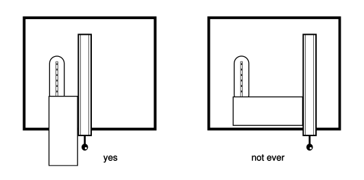

# Foam Skills 
This document treats methods for making models from structural foam.  In addition to hand techniques, some power tools will be introduced.

## Materials 
A number of different materials fit under the definition of structural foam.   The ones which are commonly used for model building are made from polystyrene, phenolic or urethane resins.  Before discussing how they may be worked, I will briefly mention the common forms, names and properties of these different foams.

#### Polystyrene

This foam is most common in its expanded bead form which is used to make styrofoam cups.  This form is not suitable for model making because it crumbles when cut or sanded.  In extruded form this foam is used for structural foam insulation  It is manufactured in light blue color hence usually called blue foam.  A pink form is also available.  

This foam is used because it is cheap, sands very quickly, and is the only structural foam used for models that can be worked with a hot wire cutter.  However, despite these benefits it is very limited in terms of model making.  Because it tends to catch and tear when cut or sanded it cannot be used to model fine detail.  It is not very strong, and can be easily melted or burned when worked with power tools.  Unless primered and protected, it can only be painted with water-based paints.  It is really only appropriate for sketch models or form studies.

#### Phenolic

Although it probably has industrial roots, right now as far as I am aware this foam is only produced for model making.  The brand name for this product is Balsa Foam.  It has gained popularity lately because it claims to be a non-toxic substitute for urethane foams (more later).  It is easily relatively easy to work, and capable of holding very precise detail.  

It is available in three standard densities, with the lightest standard density being extremely fragile, really useful only for form studies.  The middle grade is fine for more detailed work, while the heaviest grade is hard and brittle.  

#### Urethane

This is the most commonly used foam for models.  The brand name for the lower density forms is Last-A-Foam.  This foam is usually called yellow foam.  It is also used for building insulation, sold laminated to a reflective aluminum layer.  Yellow foam is excellent for model making because it can hold a very high level of detail, is relatively inexpensive, and is not as delicate as the balsa foam.

A much higher density product exists called RenShape.  This also is available in a number of densities, and because of its color is called redstuff.   Redstuff is considerably more expensive, but can be machined precisely and finishes very smooth.

#### A word on health risks

Of these foams polystyrene is probably the most benign.  The fact that it is used for disposable plates and cups is confidence inspiring.  Unfortunately, as mentioned above, it can't be used to produce models with much detail. 

The problem with the other foams is that they produce dust when sanded.  While both the phenolic and urethane products claim to be non-toxic, both caution against mechanical irritation of the skin and mucus membranes from exposure to their dust.  The dust produced by the yellow foam feels gritty and unpleasant while the dust from redstuff and balsa foam is soft and powdery.  

Terms like toxic and allergic have reasonably precise scientific definitions which unfortunately are often lost when used in common speech.  Therefore, because most of the evidence regarding the risks of using these products is anecdotal in nature, it is difficult to make a clear assessment of the health risks.  In working with any material you should use your common sense with respect to your health and these foams are no different.  Protect yourself from the dust as much as possible.  Wash yourself after leaving the shop, and certainly before you eat.  If you begin to feel badly, have eye irritation, or a headache while working with the material, go outside and get some fresh air.  If these effects persist find a better ventilated space or stop using the material.  

In a group studio environment, you must respect your neighbor’s concerns regarding health risks.  Work the material only in designated locations and take care not to track the dust elsewhere.  If at any time someone complains to you about the risks of the materials you are using, even if you have not noted any ill affects, you must respond responsibly to their concerns.

## Hand Tools

Foam is used as a model building material because it is so easy to work.  A great deal of the 
 work you do can be accomplished with the following hand tools.  

#### Sandpaper

Sandpaper is an abrasive grit bonded to some kind of substrate.  The behavior of the sandpaper is determined by the kind of grit, the size of the grit particles, the percentage of the substrate covered by the grit, the glue and the substrate.  All of these characteristics are graded, but sandpaper is most commonly identified by its grit size and whether or not it can be used with water.  The number represents the screen size through which the grit would pass.  100 grit paper has particles that pass through a screen with 100 holes per square inch.  The higher the number, the more holes per square inch, the smaller the holes and hence the finer the particles.  For shaping foam, grits in the range of 100 to 220 are probably best.  We will discuss the use of finer grades when we talk about finishing and painting in a later handout. The commonest types of sandpaper are dry paper, wet or dry, and emery cloth.  

* **Dry Paper**
This is available with a regular grit or garnet.  Garnet is harder, sharper and longer lasting.  This paper is best for working with wood, but works fine with foam.  

* **Wet or Dry**
I recommend this for model making.   Because it can be used wet or dry it is more versatile than the dry paper.  Although you won’t need the wet capability for shaping foam, it is important for sanding plastics, metals, and for finishing and painting.

* **Emery Cloth**
This is made by bonding grit to a rough cloth.  This makes a tougher product, better for the disks and belts used by power sanders.  Although it works fine, there is no reason to use it for shaping foam.   

#### Rasp
A rasp is great for removing a lot of material quickly. The kind madae from preforated steel works best.

#### Chisel

A chisel is useful for squaring up the bottoms of grooves and the corners of square holes.  However,  in working foam these operations can often be done effectively using sanding blocks which will be discussed later.  

If you do use a chisel, be careful.  Although, benign in appearance, a chisel is one of the most dangerous tools in the shop.  Clamp your workpiece or prevent it from moving in the direction you are cutting by blocking it with another piece of material.  Do not hold the piece with one hand while chiseling with the other as the chance of putting your hand in the path of the chisel is too great.  If you have your hand in front of the chisel and the chisel slips you will cut yourself very badly.  

#### Knife

For the most part, knives are not very important for working foam.  Their only real use is for carving small details.  Although it may be tempting to use a knife to cut foam into pieces this task is best left to a saw.

#### Saws

Saws designed for both wood and metal work fine with foam.  Although saws are very specialized with different blade shapes, teeth configurations and handles designed for specific tasks, these differences are fairly irrelevant when working with foam because it cuts so easily.  In general, though, a saw with small teeth like a hacksaw will be best because it is less likely to tear the foam.

#### Dremel

A dremel is a power hand tool.  It is a small variable speed motor connected to a chuck.  You can put a variety of different bits in the chuck.  It is useful for carving details into foam.  A dremel combined with a drill press attachment which holds it in a vertical position is great for making pockets in foam. 

## Power Tools
Foam  is the first material we have discussed that justifies using power tools.  I will introduce the drill press, band saw, sander, and table saw.  Although the techniques section of this handout will focus on foam, in introducing these tools I will discuss general good safety practices even if they do not apply directly to foam.  My discussion will consider only basic operations.  Complex techniques with these tools, though not difficult to learn,  is beyond the scope of this document.  Consult a woodworking guide or ask for help if you wish to know more.  If you have never used power tools you have no reason to be intimidated, however I do expect that you will not rely solely on this paper and will receive hands-on training before operating any of this equipment by yourself.

#### General Safety Issues

Before discussing the specific machines I will mention a few general safety issues.   The first involves getting part of you caught by or in a machine. To minimize the risk of this, in a shop you should wear close fitting clothing,  remove all jewelry, and tie back long hair.

Another risk in using these machines is their ability to unexpectedly grab and throw your work piece.  This is called kickback.  It is dangerous both because the thrown piece becomes a missile and because as the piece kicks your hand can be dragged into the cutter or you can be startled into moving your hand into the cutter.  Kickback occurs when the work piece gets momentarily jammed between the moving cutter and the fixed work table of the machine.  You prevent this by maintaining a constant, controlled relationship between your work piece, the machine work table and the cutter. I will explain specific kickback risks for each machine below, but in general you need to be vigilant to the risk of kickback before every operation.

Using excessive force with these machines is a common cause of accidents.  Pushing hard increases the chances that you will slip, cause kickback, or when the cut suddenly finishes be unable to keep your hands from moving into the cutter path.  None of the materials you will be using to make models is difficult to cut or sand.  Therefore, if you find yourself pushing your work piece very hard to make a cut something is wrong.  Either the cutter is dull, the cutter speed is incorrect, or you are using the wrong type of cutter for your material.  Stop and figure out what is wrong, ask for help if you need it; do not keep pushing.

The best way to keep from cutting yourself is make sure that it is impossible for your hands to contact the cutter.  Never put your hands in front of the cutter, even for an instant.  Repeat, never put your hands in front of the cutter, even for an instant.  When making cuts in small pieces, use push sticks or scrap material to push the material through the cutter so that your hands remain out of the way.

Finally, use your common sense.  If a particular set up seems dangerous to you then it probably is.  Never do something that scares you.  Ask for help if you have even the slightest concern that you might be doing something wrong.  Never use a machine that you don’t know how to operate.  Leave the shop if you are tired or hungry or frustrated.  Do not enter the shop if you are angry.  Do not enter the shop if you have recently taken any drugs.  Never rush.  

Always remember that your health and bodily integrity is infinitely more important than any  project, and more pressing than any deadline. 

#### Band Saw 

The bandsaw is used to make curved  cuts.  It is also used to resaw or split thick  pieces into thinner ones.  The bandsaw consists of two pulleys with a flexible steel blade  between them.  One of the pulleys is driven  by a motor via belts.  The blade passes  through a table that supports the work piece  and can be angled relative to the path of the  blade. 

The most dangerous thing about the  band saw is that because it is used to make  curved cuts without a fence your hands are  near the blade.  This is especially true with the  detailed work of model making.  You need to  take care that your hands are never in front of  the blade.  If the piece you are working on is  too small to hold safely then use another piece  of material to push it through the blade.      

Because of the way a bandsaw works there is no real risk of kickback.  At worst a piece of material may jam the saw but it can’t really be thrown.

#### Drill Press

A drill press is designed to drill holes in material at a controlled angle and to a specific depth.  It consists of a motor which turns a spindle via a belt and pulley system.  The spindle can be moved up and down by a lever.  At the end of the spindle is a chuck which holds drill bits. Underneath the spindle is a table which supports your work piece. You can adjust the speed of the spindle and the angle of the table relative to the spindle. 

There are 3 safety issues to do with drill presses. The first is that if you are using a chuck with a key, and you leave the key in the chuck, the key will be thrown out when you turn on the motor.  A good habit is to decide that the chuck key will always be either in your hand or in its home.  This keeps you from losing the key as well.

Secondly, you must be wary of the spinning spindle.  Long hair, drawstrings, necklaces, bracelets, loose sleeves, etc. can get instantly wrapped up by the spindle.  Pull your hair back, remove jewelry, and wear reasonably close-fitting clothing.

Finally, the kickback risk with a drill press is that if the bit binds, and the work piece is not clamped it will suddenly start spinning.  If you are drilling sheet metal this can cause a very nasty injury, but even the edge of a piece of wood can cut you. The risk of kickback is pretty low with standard twist drills, even larger ones. Hole saws are very dangerous and must only be used with a well-clamped workpiece.

#### Sander

Sanders are for rapidly removing stock when cutting it off is not appropriate.  There are two common styles: belt and disk.  As their names indicate, belt sanders consist of an emery cloth belt which is driven over two pulleys, while a disk sander consists of a disk of emery cloth bonded to a metal plate which spins.  Both types of sanders have a table to support your work which can be angled relative to the surface of the sanding medium.  

The primary danger of a sander is that, like a bandsaw, you will often find yourself doing small, detailed work with your hands extremely close to the moving belt or disk.  In this situation the likelihood of accidentally sanding a knuckle or fingertip is very high.   The abrasions resulting from such an accident take a long time to heal, are painful for much  longer than a sharp, clean cut, and leave a significant scar.  Avoid this accident by always  maintaining an inch or so of material between you and the sanding medium.  If your piece is too small to sand safely, temporarily attach it to a larger piece with double sided tape.

If you are careless a sander can tear something out of your hand instantly.  You normally prevent this by holding your work piece down on the table so it can’t be thrown.  On a disk sander, sand only on the side where the disk is moving down past the table.  

If your piece is large or you want to sand a radius you have to lift it off the table.  When you do this you have to be extremely careful that you don’t let the sander catch an edge of your piece.  When free sanding the long edge of your piece must always be parallel to the motion of sander.

#### Table Saw

The table saw is for cross cutting and ripping material.  It is also for cutting grooves or dadoes.  It consists of a motor mounted underneath a table.  The motor spins a shaft upon which is mounted a round, flat blade.  The speed of the motor cannot be adjusted, but the height and angle of the blade relative to the table top can be.  A moveable fence which runs parallel to the blade is used for ripping, while a separate cross slide is used for cross cutting.  Despite its simplicity, the table saw is an extremely useful tool.  It is the most precise tool discussed in this handout.  

It is also the scariest, though I still think the simple chisel is involved in more accidents.  In any case because of its noise, size and obvious violence people automatically treat the table saw with respect.  Unfortunately they focus on the saw blade, while the real danger of this machine is kickback.   Most kickback with a table saw comes from using the parallel fence incorrectly.  It is only meant for ripping, that is, cutting with the long side of your work piece parallel to the saw blade.  If you use the parallel fence for cross cutting your work piece can start to rack or cock between the blade and the fence.  As soon as this happens it will come flying out of the saw.  Never cross cut with the parallel fence. 

Even when using the fence correctly there is a danger of kickback.  If, as you are making your cut, you let off pressure on your work piece and it shifts even slightly so that the blade contacts the side of the kerf the piece will be pushed back towards you.  For this reason you must never let go of your work piece until it is pushed all the way beyond the saw blade.  Because the likelihood of this occurring increases as the space between the blade and fence decreases never try to rip a piece less than one inch wide, even with push sticks.

With cross cutting there is a danger that the piece which is cut off will contact the blade and be thrown.  Therefore, after every cut you should turn off the saw, wait for it to stop moving, and then move the cut off away.  When making multiple cuts, this can seem like a huge bother, but just make it habit.   

Kickback can also occur with either cross cutting or ripping if your work piece does not sit flat on the table.  If, during a cut, your piece rocks or shifts it will bind against the blade and be instantly thrown.  To use the table saw your work piece must have a flat surface which can be placed against the table and if you are using the parallel fence then the surface against that fence must also be flat.

Finally, push sticks are very important with the table saw.  When ripping anything where the fence is less than 6" from the blade use a push stick to move the material past the blade.

## Adhesives

The best adhesives to use depends on which foam you are using and the situation.  #### Polystyrene

Use the double surface technique with rubber cement or spray mount.  Double sided tape also works.

#### Phenolic

Use the double surface technique with spray mount for laminating larger pieces together.  For finer work you can use aliphatic wood glue or cyanoacrylate glue.  The thicker cyanoacrylates are better but you still need the accelerator.  Put the glue on one piece, spray the accelerator on the other, then hold them together for about 30 seconds.  The bond is not instant so you can reposition it within the first 5 or 10 seconds.  Be careful with the cyanoacrylates because you really can glue your fingers together, though acetone will dissolve the bond.  I have found that with the phenolic foam you must use considerably more cyanoacrylate than with the urethane foam.  Also, remember that because the foam is fairly delicate, the bond will be delicate no matter how much glue you use.

#### Urethane

You can laminate large pieces of the yellow foam with spray mount, and adhere small pieces with cyanoacrylate and accelerator.  For redstuff use cyanoacrylate.  Just a few drops will produce a very strong bond.

## Shaping Techniques

Foam differs from the other materials we have discussed thus far because it is truly structural and three dimensional.  As such it can be used for an enormous variety of things and worked in  many different ways.  I will only touch on a few here.  As you build models you will need to take these techniques and expand, modify, and combine them.  Never hesitate to invent a new way to do something, as long as you first consider your safety and the safety of those around you.

#### Sanding

Except for the highest density foams like redstuff, these materials cannot support extremely precise work.  This doesn’t mean you can’t use foam for very detailed work, it just means that you should concentrate on the appearance of the details rather than on their exact measurements.  Sanding lends itself very well to this kind of work.

There are two ways to control sanding and they can be used together or separately.  The first involves sanding blocks.  This means wrapping your sandpaper around something before you sand your foam.  The shape of the block will then determine the shape of your foam.  Most of the time you will use a flat block in order to get a flat surface on your foam, but you are not limited to this.  If you want to make a half-round groove, wrap your paper around a dowel.  If you need a v-shape groove, make a block that has the profile you want.  If you want your groove to have a particular dimension you will need to take into account the thickness of the sandpaper.

Anything can serve as a sanding block, though the denser the material the more durable and accurate it will be.  A medium soft wood like douglas fir is a good choice.   You can either just hold the paper onto the block or you can attach it with double-sided tape or spray mount.  For sanding a surface flat you can stick a whole sheet of sandpaper down on a table top.

The other important sanding technique is to mark your work piece and sand to the lines rather than sanding to a particular dimension.  You can  make lines with a Sharpie or, if your working drawings are to scale, you can glue the drawings directly to the piece of foam with 
spray mount.  This is particularly useful when using a power sander.

#### Carving

The key to carving, either with a knife or a chisel, is using stop cuts.  Stop cuts are cuts that you make which are perpendicular to the cuts you will make to remove stock.  Their purpose is to prevent the cutting tool from going past a certain point.  Once you have removed stock down to the bottom of the stop cut, deepen the cut and repeat the process.  

#### Square Holes and Pockets

While you can make a square hole from start to finish with careful chisel work, it will be faster if you begin with a round hole.  If your hole is small, then drill exactly the hole that can be inscribed in your square.  To square up the corners you can either use a chisel or a file.  A file seems easier, but a chisel, if sharp and used carefully, will produce a better result.

If your hole is large, then first mark its boundaries on the foam.  Next use a drill to hog out, or remove as much material as possible while staying within the lines.  Finish to the lines using a chisel, file or sanding block depending on the situation.  

Pockets are blind holes, or holes that don’t go all the way through.  The easiest way to make these is to make a through hole and then glue a bottom on it.  If you plan your model carefully, you may be able to make most of your blind holes this way.  Sometimes, though, you can’t use this technique.

If your pocket is round and small you can just drill it using a flat ground drill bit or an endmill, being sure to set the depth stop on the drill press.  If it is large and round, mark the edges and then hog out material with an end mill.  A drill press with an endmill in it, set to a fast spindle speed, with your hands replacing the x and y controls makes a pretty decent substitute milling machine for foam.  It is dangerous to use this technique with any other material, however.  

If your pocket must be square use the same technique as above.  If you clamp a piece of wood to the drill press table you can use it as a fence.  When you run your foam against it you will get a perfectly straight cut along your line.  You can square up the corners of the pocket with a chisel.

#### Cutting and Dadoing

Cutting is best done with a saw.  Short, straight cuts can be done by hand, but long cuts or curved cuts should be done with a band saw.  If you are concerned with the precision of your cuts use a table saw.

On thinner pieces of foam when you are not overly concerned withthe edge of your cuts use the score and smap method. Make a few shallow cuts in the foam using a utility knife, then hold the piece with the score facing away from you and using your thumbs behind the score, snap the piece in two. You can even make curved cuts this way. The deeper the scores the better the edge with be, but this technique is really most appropriate for roughing out a piece prior to sanding it.

Dadoing is done with a table saw.  If your groove is not wide, then just make multiple passes over the saw blade, shifting your piece a saw blade’s width each time.  If the dadoes are wide, or you need to make a number of them then install the dado blade.

#### Preventing Tear Out

Tear out is what happens at the very end of cut.  Just as the cutter is about to break free of the material there is not enough material left to support the force of the tool.  So right at the end of a cut or the backside of a hole material tears away, leaving a rough edge.  If this becomes a problem you can prevent it by backing up your work piece with a scrap piece.  Then just as the cutter leaves your piece it enters the scrap.

#### Building Large or Irregular Shapes

Often you will not be able to make your part out of a single piece of foam.  In this case you will need to build up your shape from smaller pieces.  If the problem is just that your part is thicker than your stock you can laminate two pieces together.  When you do this you will need to be concerned with the glue joint.  The adhesive has different properties than the foam which will become apparent when you cut or sand along the glue line.  For instance, cyanoacrylate cures very hard so it resists sanding much more than foam.  If you sand them at the same time the foam will sand faster than the glue and a ridge will appear at the joint line.  You can avoid this by keeping your glue within the final perimeter of your model.

When your model will be irregularly shaped you will need to build it up from smaller pieces.  Doing it this way, rather than cutting it out of a huge block is faster and less wasteful.  Begin by imagining your model as a collection of primitive shapes: cubes, cylinders, and rectangular prisms.  Cut these pieces out, glue them together and then shape them to their final form.  In some parts of your model it may be better to do some shaping work before joining the pieces together.  The blind holes described above are an example.  We will discuss this in more detail when we talk about operation sequence. 

#### Joinery

Foam does not call for fancy joinery.  Butt joints are adequate.

## Surface Treatment

Foam models require at least a coating of primer or they will leave dust everywhere.  Use only water-based paint with blue foam or you will melt your model.  We will discuss finishing and painting in considerably more detail later.
