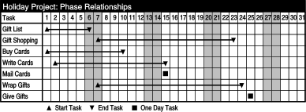

# Planning Skills
This document is about project management.  Even the simplest model building project involves, at least implicitly, a management component.  I will discuss tools for planning a project, followed by the contexts which define a project.  Finally, I will describe the essential elements of a project which must be organized.  This may seem a bit involved for a simple model, but the process I describe can be scaled appropriately for large or small projects.  

## Tools 
Project management is really just organizing.  Organizing is personal; each of us has our own way of finding,  sorting and keeping track of things.  For most of our activities this process is informal and undocumented.  In building models, however, it makes sense to increase the rigor of our process because we may be working with components with which we are unfamiliar, we may have a number of critical details to keep track off, and finally we may at any time need to explain what we are doing to someone else.  Although I don’t advocate that you abandon trusted organizing techniques, you may consider including some of the commonly used tools described below.

#### Filing

Much-maligned as an activity, filing is essential to managing your project.  Filing can take on a life of its own, so do not let it get out of control.  Remember that the point is to create a place to put things.   For a simple model you may be best served by keeping information about the project in your log book.  A more complex model might require a binder, which has the portability of a log book but allows the re-organization of the material it contains.  If your model is part of a larger project then you may have a set of files in a filing cabinet that deal with the entire project and a binder for the particular model.  

Although duplicating files makes sense from the point of view of protection against loss, it adds greatly to the management overhead.  As soon as you have two copies of something, any change must be made twice.  This introduces the possibility of confusion regarding the most up to date document.  The only way to prevent this is to number documents and log revisions.  This may be inevitable for larger projects, but best avoided for smaller ones.

#### Goal Statement

This is the first thing I put in my filing system.  The goal statement is a concise, written description of what I am doing and why.  It serves as a touchstone for me and an essential tool for explaining my project to others.  For a simple model this will be just a sentence or two describing what I am trying to model and what I want the model to do for me.  For more involved projects I  include scheduling and budgeting goals, as well as a brief background statement and justification.

#### Task List

This item is self-explanatory except that it does bear stating that there are really two kinds of task lists.  The first is predictive: it list the things you think need to happen in order to reach your goals.  This list is created before the project has begun.  The second type of list is corrective.  It is created after the project has produced a result which is in need of revisions.  

The other important point about task lists is that they should always be thought of within a certain context.  In other words the task list for painting your model will be a subset of the task list for finishing your model, which will be a subset of the list for building your model.  These lists will have differing levels of detail.  To refer to other tools described below, the painting list will read more like an operations sequence, while the building list will look more like a schedule.  You needn’t create a list for every step in creating your model, but you should do it anytime you feel overwhelmed by the details or you are unsure how to proceed.  The list will make the details manageable and it will also make clear the steps you don’t understand.  Once you have identified these steps you can get help.

#### Flowchart

A flowchart is a graphical representation of activity.  It consists of milestones, the steps required to reach those milestones, and pathways showing the relationship between the steps and the milestones.  Flowcharts also indicate decision points at which the flow of activity can be redirected.  Conventionally milestones are indicated by textual descriptions surrounded by squares, steps by text inside a circle, and pathways by arrows.  Decision points are shown as questions contained within diamonds with the alternative pathways branching from the corners of the diamonds.

The success of a flowchart as a planning tool requires that you graphically differentiate the components in your flowchart and make the textual descriptions as concise and accurate as possible.  As you do this you will start to see the words surrounded by their borders as icons or pictures rather than text you must read.  At that point you will be able to grasp the flow and pace of the activity by looking at the chart as a picture rather than reading it like a list.  This will let you analyze it with a different set of intellectual tools.  You will be able to re-arrange the steps in your mind, and imagine whether the process makes sense or might be better organized in a different way.  Spending time creating and playing with a flowchart will give you an intuitive “feel” for a process which you could not get from a list or description.

#### Schedule

You use a schedule to assign dates to the important stages of your project.  You can base the dates on when the stage is completed, or when it is begun, or both.  The events which appear on your schedule are obviously only a subset of all the events which must occur to finish the project, but they should be the most representative ones.  If someone else is expecting you to deliver something, for example, drawings for a presentation, that should be on your schedule.  You would also explicitly schedule the completion of an event that allows you to move to a new stage.  Finalizing the design of your model is of this sort because you cannot begin production until it is complete.  These events, the kind that can hold you up until they are finished, are said to be on the “critical” path of the project.

Schedules can be as simple as a list of dates and description, or they can be laid out in a grid like a calendar.  Another common form is to create a table with the dates along the top axis, and the events along the side.  The actual time the event will take is represented by a horizontal bar which begins on the scheduled start date and ends on the end date.   The following examples show different way to look at the same scheduling information for a holiday project.

First we have a simple list of the crucial deadlines.

| Deadline | Task                  |
|----------|-----------------------|
| 12/01    | Start Holiday Project |
| 12/12    | Finish Gift list      |
| 12/15    | Mail Cards            |
| 12/23    | Finish Shopping       |
| 12/25    | Give Gifts            |

We could put the deadlines on a calendar, and include intermediary tasks, to give a better sense of the amount of the lead time available to complete the project.

A Gantt chart is an visual that focuses explicitly on when tasks must start and end to achieve success.

A flowchart approach helps to visualize the critical path, that is, the steps that must be completed in order and by each deadline to avoid blocking project completion.

#### Budget

Because cost is always an issue, and at the same time people want perfect solutions, every project begins with a misalignment between expectations of what will be done and what will be spent.  A budget is the most effective way to for people to face this misalignment and decide how to rectify it.

Budgets are usually presented in terms of money or time, and are most useful when organized by stages showing the projected output of each stage and its cost.  Looking at the budget should give a sense of the relative importance of each stage and also promote thinking about the project as editable components rather than an amorphous, confusing whole.  This makes it easier to reach reasonable decisions about how much to pay for particular results.

As an example, if you are planning a model with a number of features you could produce a budget that showed not only the overall time the model will take, but also the time you anticipate spending on each feature.  If the overall budget is too large, in other words you won’t be able to make your deadline, then you can use the budget document to assess the importance of each feature and decide which to cut to get the overall budget in line with the actual time you can spend.

#### Operation Sequence

An operation sequence describes each step in a particular process.  It is used to figure out the easiest and most successful way to complete the process.  The most important issue is to be certain that completing a step does not prevent the completion of a subsequent step.  For example, imagine that you are going to perform several cutting operations on a piece of foam.  You have created layout lines for your cuts on one of the surfaces.  Before you begin cutting, you must plan the operation sequence so that you don’t ever cut off the layout lines you need for the next cut.  

Another use of an operation sequence is to increase efficiency.  Many processes can be done a variety of ways and yield the same final result.  Different sequences will take different amounts of time, though.   For example, imagine you are making a model with two parts and one of the parts must be made from wood that has been laminated together.  The most efficient way to work would be to start the first part by laminating the wood, then switch to the second part.  Once you have completed it, the glue will be dry and you can finish the first part.  If you had done it any other way your parts would have been the same at the end, but at some point you would have had to wait for the glue to dry.

Operation sequences can be formatted as an ordered list of steps or they can be more like storyboards, with sketches and words explaining each step.  Especially when I do not know exactly how to do something I find it very helpful to try the storyboard approach.  The act of drawing what I want to happen makes me think about the process in a more intuitive, holistic 

way that just describing it with words.  My storyboard also makes it easier for someone else to 

## Contexts 
Most projects, and all model building projects, produce a tangible, physical result  The reality of the result, and the effort it took to make it appear, creates a tendency to see the object and the project as the same thing.  This view is not accurate.  The object is simply a result; the project is all the thousand decisions that led to that result.  Each of these decisions, in turn, are made within a particular context.  Project contexts can be mundane issues like scheduling or incredibly complex ones like culture.  Here I will discuss four of the most obvious project contexts: goals, expectations, time and scale.

#### Goals

Every successful project has clearly defined goals.  This is true regardless of scale.  Although it may seem like overkill for smaller projects, you should get in the habit of creating goal statements for every project in which you are involved. Your goal statement should reflect what you think will make the project a success.  Being explicit about what you want makes it possible for you to communicate what you want to others.  Include not only what you want to accomplish, but how you want to do it, who you want to affect, and what effect you want to cause.  

You have no control over other people’s goals but you have complete control over your own.  This means that in developing goals for a project, you should be primarily concerned about pleasing yourself.  I am not advocating selfishness, instead I am assuming that among your goals will be to do quality work, to develop useful solutions, and to satisfy the demands of those for whom you work or owe allegiance.  I am suggesting, however, that in assessing what it will take to satisfy those goals you look to yourself and understand what will make you happy.  In other words, don’t just try to please other people, but making pleasing other people one of your goals.  This will assure that making them happy will make you happy too.

How is this relevant to building a small project?  Assume that someone has asked you to build a model.  You must try to understand what he wants, but realistically, you can’t know exactly what he wants.  If you try to build the model he wants you will have questions throughout the process, you will second guess yourself, and you will make mistaken assumptions.  The result will not please you or him.  Instead take what he has told you, internalize it, mix it with your own ideas, and develop a set of goals for the model that reflect your understanding of what is important to you and him.  Show him the goals and if he agrees with them you can build this model with confidence because you are sure of the goals. 

#### Expectations 

Using a goal statement to make sure you are in agreement with someone else is an example of the single most important project planning issues: managing expectations.  As you begin a project just about the only thing you can be sure of is that everyone involved has different expectations.  Even when a project just involves two people, such as an assignment between a teacher and a student, there are often very different expectations.  Managing the project successfully involves lining up these expectations.

Expectations can diverge in obvious and also subtle ways.  It is often the subtle ones that cause the most difficulty.  For example, as a teacher, I feel it is my responsibility to be extremely clear about what I expect from my students.  To this end I spend time writing careful, complete assignment sheets.  I have found, though, that no matter how much time I put into writing the assignment, it is wasted on some students who don’t meet my expectation that they read what I have written.  

If the people involved in a project all have different expectations then no matter what the result not everyone will be satisfied.  In the case with the students who don’t read the assignment, I am not satisfied with their work because it does not meet my expectations.  They, in turn, are dissatisfied with their grades because they feel it does not reflect the amount of work they 

In order to minimize this I try to identify the students who may not learn best by reading and follow up with them verbally to help them understand what I expect. I also try to touch base with all students during the project to make sure that what they are doing matches with what I expect them to do.  Because expectations have such an effect on the perceived success of a project, you may need to go out of your way to make sure they are shared.  You must check, not just at the beginning, but throughout the project that everyone’s expectations remain aligned.    

#### Time

Time is one of the most interesting project contexts because, while its progression is inevitable, you can manage the relationship between its flow and its effect on you.  In order to control the time framework you need to understand the different kinds of time, and the changing value of time.

*Time and Working Time*

The first crucial distinction is between time and working time.  The time it takes to do a day’s work is not the same as the time it takes for a day to pass.  It is never more and usually much less.  As a society we have agreed that for the purposes of negotiation, salary and employment a day’s work is eight hours.  The exact choice of eight hours may seem arbitrary, but it really turns out to be the amount of time a person can happily, productively, and continuously spend working.  It is the rare individual who can maintain a schedule of more than eight productive work hours in a day and no one can keep up a heavier schedule for very long.  A person may stay in the work environment for much longer, 10, 12, or even 15 hours, but as the hours increase the amount of unproductive time increases geometrically.

What this means is that a week’s work is really no more than about 60 hours and only 40 if time is taken off for the weekend.  Because a week actually represents 168 hours it is very tempting to try to fit more than 40 hours of work into a week during your planning.  However, you will almost always need more time than you have planned so if your planned time encroaches on rest time the reality will be that you will have almost no rest time at all.  You will get through the project but you will not enjoy it.  Nor will anyone else who had to suffer as a result of your optimistic planning.

*Management and Production Time*

Work time itself breaks down into management time and production time.  Production time is that which you spend actually producing a tangible result while management time is spent arranging things such that you can do production work.  Production time tends to seen as more important because it is responsible for the tangible result, but in fact it can’t occur without management time being spent.  With small projects, management time is not that significant, but it becomes increasingly important as the scale of a project grows.  If you plan your schedule (this is management time) without considering management time you will find that things are always taking longer than you expected.  

*Bid Time, Hourly Time and Salary Time*

Another way to slice up work time is how it is paid for.  A bid is a fixed price for a job that will not change no matter how much (or little) time it takes.  The point of bid is to de-couple time from money.     

Hourly time makes the relationship between time and money explicit.  The money spent for the job will exactly reflect to the amount of work time spent on the job.  However, the cost of the job can’t be known beforehand.

Salary time is a combination of bid and hourly time.  It is a fixed price for work, like a bid,  but it is paid with respect to time, like an hourly rate.  It is different from both other kinds 

of pay, though, because it represents an open-ended commitment between the payer and the pay-

*Work Time and Lead Time*

Finally, you must consider the difference between work time and lead time.  Work time is concerned with hours while lead time is concerned with dates.  As described above a week’s work is 40 hours more or less.  But if I tell you that I will have a model built in a week that doesn’t mean that I need 40 hours of work time to make it.  Probably I think I need much less than 40 hours.  But, given the amount of actual work I have to do, the amount of work I have to get other people to do, and all the various and unforeseen things that have to happen, I won’t promise the model unless you give me a week’s lead time.

Lead times can dramatically lengthen a project schedule.  For this reason it makes sense to see if they can be minimized.  If a vendor quotes you a long lead time, ask him why, and see if there is anything you can do to reduce it.  Sometimes it is just a matter of being clearer about what you need.  I have found that negotiations done face to face usually result in shorter lead times than negotiations conducted by phone.  In some cases a little extra money can make a huge difference.  

Because lead times are often based on worst case scenarios there is a tendency to discount them during the planning stage.  Do not make this mistake.  Various and unforeseen things really do need to happen.  Mistakes need to be made and fixed.  People will get sick or sleep in.  Messages will get lost and people will change their minds.  Occasionally things will happen faster than projected, but don’t plan on it.  

*The Changing Value of Time*

Although time of whatever type flows along constantly, most projects have a finite duration.  This means that the perceived value of time changes over the course of a project.   As long as there is plenty of time, money becomes the driving force when making planning decisions and the least expensive route is attractive, even if it slow.  When deadlines draw near, however, suddenly time becomes very important and things that will speed the project get done even if they cost a lot.  The panic at the end of a project can be expensive.

The panic is real.  No matter how carefully you plan deadlines always seem to appear suddenly, and there is never enough time to do everything you had planned.  However, the way to avoid the extra expense is by expecting to run out of time, rather than being surprised to run out of time.  If you include this reality in your budget from the beginning your expenditures will be more balanced and you won’t find yourself forced to spend money at the end to finish the project.  You won’t have to purchase inferior, expensive materials at the last minute.  You won’t have to accept whatever bid you get from the only vendor you can find who will meet your pressing deadline.  You will be able to pay rush fees out of the contingency fund in your budget rather than out of your pocket and you may even have collected coupons to reduce the price of the late night pizza.  If you recognize time as the predictable, constant force that it is, you will have a careful, controlled response when it starts to run short.

#### Scale

From the discussion thus far I hope you are convinced that project management is a part of every project, regardless of size.  It follows that the amount of management required grows as the size of the project grow.  What is not so obvious, though, is that this growth is not linear.  Larger projects require a lot more management than smaller projects.  The scale context is important because a quantitative change in the scale of a project results in a qualitative change in the realities of managing it.  If you are not prepared you will not appreciate how an increase in the number of components and people involved will affect your project and your role.

*Parts*

More components increase complexity in part because you must understand the details of each new component. This is essentially linear: more things to know, more things to know about them. The real increas in complexity, though, comes from the geometric increase in relationships that each component adds. A simple example will make this clear.

Imagine a project called P with only two components, A and B.  In this case there are only three relationships to keep track off.  There is the relationship between A and B, the relationship between A and P and the relationship between B and P.  Now, let us add one more component: C.  We have only increased the number of components by one, but the number of relationships is now 9.  Three relationships are those between each component and the project (A to P, B to P, and C to P).  Three come from the relationship between each component (A to B, B to C and C to A).  And three come from the relationship between each pair of components and the third component (A&B to C, A&C to B, B&C to A).

What this means in terms of management is that you should be loath to increase the number of components, and always on the look out for ways to reduce them.  The overhead associated with a single part can be the difference between an on time, under budget project and a project you cannot finish.  Every component must serve a definite purpose which supports your overall project goals.  If you find yourself with too many parts, and no way to reduce them without changing your project, it is time to think about changing your project.

*People*

While at one level, people are simply another component, if you treat them like that your project will be a frustrating, difficult process for everyone involved.  Certainly, managing people means learning their relevant details and paying attention to their relationships, but these things are on a much higher level of complexity than for any inanimate component.  This is because the properties of a particular material used in your project seldom change; the feelings, agendas, whims and assumptions of the people in your project change all the time.  The dynamic, unpredictable nature of people means that they will affect the project in ways that will constantly surprise you.

The surprise means that working with others is always both enriching and frustrating.  How you manage your project will determine the ratio between these two.  Most of us get very little practice with group projects until we finish school and begin working.  Team sports are one of the few group project experiences that we know from our youth.  However, if we try to employ the intense, dictatorial style of management we saw on our little league team we find out rapidly that coaching is not acceptable in the working world.  The only real alternative, the one that yields a high enrichment to frustration ratio, is delegation.  

To delegate a task you must explain to someone what you need from them.  Then you must let them create that thing how they choose.  This doesn’t mean walking away from the process, on the contrary, you must stay involved, answer questions, give and get feedback.  But you must also give the other person the respect and the space to solve problems himself, to make mistakes and to fix them.  If you think of the thing each person does well as his art, then the goal in project management is to let each person do his art.  

Succeeding at this requires two things.  The first is that you give people tasks which are in line with their art.  You do this by learning what interests each person.  Time spent learning about people, what they know about and what they like, is time very well invested.  No matter what his job title or description, each person really only does the things that interest him.  If you give a person a job that is fits his interests it will be done rapidly and well.  You and he will both be delighted with the result.  He will want to work with you again.  If you ask someone to do a task which they don’t understand, don’t like, or find boring, the result will disappoint both of you and your relationship will suffer.  As the manager it is your responsibility to ask people to do things that they can do well.

Your second responsibility as a manager is that you know what you want.  If you give someone a task and have a specific result in mind, you must communicate that result clearly.  If you don’t you will be disappointed by the work they do.  Because people have personal learning styles you must be prepared to use a variety of methods to communicate your goals.  When words seem inadquate, use pictures or models to explain your ideas. Sometimes the only way to communicate a goal is to let someone do the thing you don't want so that you can then explain to them how it differs from what you did want. However, none of these communication techniques will help if you haven’t clearly defined your goals for yourself.

## Elements 
Now that we have discussed organizational tools and project contexts we can look at what actually needs to be organized.  I have placed these elements into three categories: resources, roles, and responsibilities.

#### Resources

Resources are the “tools” you need to complete your project.  Examples are materials, tools, information, or people.  The defining characteristics are things which are essential to your project but to which access may be limited in some way.  You need to organize them so that they will be available when you need them.  

First you need to identify them.  Do this by examining your planning documents and your notes.  Next you need to establish a relationship with each resource.  In the case of a material this means finding out where and when you can buy it.  If the resource is a person then you may have to spend time up front negotiating a relationship or establishing your own credibility so that at the moment you need the person he will be willing and prepared to help you.

As you go through the process of defining and locating resources it almost always pays to think long term.  Perhaps you only need a little bit of plastic for this project.  It is still worthwhile, if you have the time, to look around to find what you think is the best supplier.  Find one who knows a lot and is willing to answer questions.  Find one who you like.  Right now you think you only need a little bit of plastic, but who knows what you will need in the future?  For this reason, it is worth treating every new relationship as if it might be the beginning of a long term relationship.

A related concept to this is for every resource you should try to assess its dependability.  In other words, how much can you trust this resource to be there for you, to help you,  and provide you with quality?  The less secure you are, the more you should look for alternatives and backups.  This way of thinking applies to both people and inanimate resources.  The idea is to make sure that you always have options, no matter what difficulty you encounter.

#### Roles

Roles clarify who will to do what.  Assigning roles is essential for larger, multi-person projects, but it is helpful for smaller projects as well.  if you are working on a project by yourself you will have multiple roles.  Identifying each one, and thinking about what you will have to do as that role will help you analyze the steps and pieces of your project.  

By a small stretch you can even apply the concept of roles to the inanimate resources in your project.  In building a model, for example, if you are counting on one part  to perform a certain role, say, be stretchy and waterproof, this can help you identify the appropriate material for the part.

The most important thing to keep in mind about roles is that they must be consistent with the skills and characteristics of the individuals.  As I described above, make sure that the roles you assign will let people do their art.  Again, you can apply this to inanimate resources as well: the intended role of the material must match its inherent characteristics.

#### Responsibilities

Responsibility is different from role because role describes what you do, responsibility describes what you will deliver.  Responsibility is a synonym for accountability.  Responsibility describes how you will be judged and so it is kind of scary.  You can reduce the fear factor somewhat by using the goal and expectation frameworks to define precisely the extent of your responsibility.

Organizing the responsibility in a project means not only defining it but assigning it. The most important thing when assigning responsibility is to let fo of it yourself. This is hard to do.  If the entire project is your responsibility, it is frightening to give part of it to someone else.  If they do a bad job it will reflect on you.  However, they can only do a good job if you give them real responsibility, and the trust and respect that go along with it.  Again, you must let people do their art.  

Along with assigning responsibility comes empowerment.  You must be certain that if you have given someone a role and responsibility you have also made sure that he will have access to the resources he needs.  These include enough time and an understanding of what you want.   You must also provide a means and a standard against which he can check his work.  Give everyone involved a goal statement, a list of expectations, and a schedule.

#### Conclusion 
Clearly the scope of what I have written here has often gone beyond that which is involved in building a model.  On the other hand I think most of these concepts can be applied on a personal level.  For example, just as a manager must assign responsibility to others and trust that they will do a good job, working alone you must trust yourself to build a good model.  You must also empower yourself.  Give yourself enough time and make sure that you have access to the resources you need.  Clarify your goals.  Most importantly, give yourself a way to succeed by charting a clear and sensible path to success.  This is the essence of project management, and every project, no matter how small, will benefit from it.
