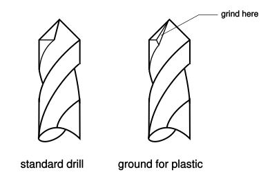

# Plastic Skills
This handout introduces plastic as a modelmaking material.  I will discuss the characteristics of some of the most common plastics, but most of the handout will be directed towards working with acrylic.  I will also introduce a few new power tools and the topic of threaded fasteners. 

## Material 
The term plastic encompasses a huge number of different materials.  The below are the ones you will most likely encounter in model and machine shops.    

#### ABS

ABS is made by compounding styrene and rubber.  This makes it a versatile material.  It is dense and reasonably tough, but machines well.  In thin sheet form it is also an excellent choice for vacuum forming.  It is often the “next step” from renshape when creating a model that requires a lot of machining because it is more durable than foam.  In industry it is often used for making check models.  It can be bonded with ABS cement.

#### Acrylic

This is the plastic that you will probably use most in making models.  It is often referred to by its brand name Plexiglass or Plex.  Acrylic is reasonably-priced and comes in a large variety of standard shapes and sizes.  It cuts, machines and sands well, though it is brittle and breaks if not handled correctly.  It is almost as optically pure as glass and hard enough to withstand reasonable abuse without scratching.   As we will discuss later it can be solvent bonded.

One important thing to know about acrylic is that rods and tube are available in both extruded or cast form.  The cast material costs more, but machines much better.  Also, because of the internal stresses developed during the extrusion process, the extruded material may craze, or develop fine cracks, when solvent bonded.

#### Delrin

This material is often used in machine shops and less so in model work.  I mention it only because its color is a pure, glossy black so it can be used to advantage as an aesthetic accent.  It is dense and tough, but machines beautifully.  Because it is smooth it can be used to create a bearing surface.  The disadvantage of delrin beyond its cost is that it can’t be bonded with any glue or solvent.

#### Nylon

This is not very useful as a model making material, but it does turn up in machine shops.  It is extremely tough, but difficult to machine.  It is an ugly off white color.  I doubt you will have call to use it.

#### Polycarbonate

The brand name for this material is Lexan.  It is not as clear as acrylic, but is much tougher.  Bullet-proof glass is actually polycarbonate.  Because it is softer and gummier it doesn’t machine as well as acrylic, but on the other hand it doesn’t break either.  It comes in the 
same variety of shapes and sizes as acrylic but is more expensive. It can also be solvent bonded.

#### PVC

Plastic plumbing pipes are made from PVC which means that tubes and connectors in a variety of sizes made of PVC are cheaply and commonly available.  This makes it a great material for building structural prototypes.  Unfortunately, it isn’t very stiff so unless carefully planned large structures will tend to sag.  It cuts easily, but not very cleanly unless the cutting tool is extremely sharp.  It can be bonded effectively with PVC cement available at any hardware store.

#### Styrene

The main advantages of this material is that it is cheap and common.  It cuts very easily, in fact even thick sheets can be cut by the score and snap method.  Structurally it is stiff and brittle.  It is usually white or clear.  It vacuum forms very well.  

#### Teflon

This is another material that really only turns up in machine shops but I mention it because its color is pure white, so like delrin it can be a good aesthetic accent.  It makes for a nearly frictionless bearing surface and can withstand very high temperatures.  With sharp tools it machines very well.  It is very expensive and as you might imagine, can’t be glued at all.

## Hand Tools

There are no special hand tools for working plastic beyond what we have discussed in previous handouts.  Because plastic is considerably more difficult to work than any of the materials we have discussed so far, you want to do as much of your shaping with power tools and restrict hand operations to final fitting and finishing.  Your tools should be as sharp as possible.  Also, you will always want to wet sand plastic.

## Power Hand Tools

Here we introduce a new category.  Power hand tools are, as the name suggest, tools that are controlled by hand but contain electric motors.  Examples include drills, circular saws, and routers.  Drills are so common I do not feel the need to explain their use.  Circular saws really have no place in modelmaking.  Routers, however, are very useful.

#### Router

A router is essentially just an high rpm electric motor.  The motor fits in a base which has a handle on either side and a flat surface perpendicular to the axis of the motor.  The end of the motor arbor is threaded and has a tapered bore to accept a collect.  A router bit is placed in the collet and tightened in place via a nut on the motor arbor.  To adjust the amount of cutter that projects beyond the router base, the motor may be slid up and down within the base, but not while the router is running.  A variation on the standard router, the plunge router, permits the motor to move while the router is spinning.

The router is operated by setting the base on a securely clamped workpiece with the bit clear, turning on the motor and then sliding the router across the work surface until the cutter makes contact.  Although it is possible to route entirely free of guides, this is usually not done.  A router is guided in one of two ways.  The edge of the base may be run along a guide that has been clamped across the work piece.  Or, the router bit may have a bearing mounted on it which makes contact with part of the edge of the work piece.  The cutting part of the bit then removes the rest of the edge.

In another variation, a router may be mounted upside down under a table with the bit projecting through a hole. In this case the router remains still while the work is moved past it, always against the direction the mortor is pinning. Control is either via a moveable fence or the bearing on the router bit.

Routers are used primarily to shape the edges of flat stock.  This can mean either cutting the stock to a particular shape or putting a profile on the edge.  Cutting stock to a particular shape involves using patterns which will be discussed in a future handout.  Profiling an edge requires a bit with the profile that you want.  For modelmaking this is generally a radius.

The most important safety consideration with the router is to cut in the correct direction.  The relative motion of the router bit and the stock must always be in opposite directions.  In other words, feed direction must be such that the router bit is always trying to push the material back the way it has come.  This is the only way you can maintain control of the operation because this way as soon as you stop pushing the operation will stop.  If you do it the other way, the router bit will be trying to grab the material.  And it will succeed.  When it does, in normal mode, the router, still spinning, will come flying out of your hands.  Or, in table mode, the work piece will come flying out of your hands.  Either is bad.

## Power Tools

All of the power tools mentioned in the foam handout are relevant to working with plastic.  The same safety concerns apply, in fact you need to be even more careful because plastics are denser than foams so are more likely to cause kickback and will be more dangerous if thrown.

I will introduce two new machines: the machine lathe and the milling machine.  These two are essentially the defining tools of a machine shop.  They are capable of much more precise work than any of the tools we have discussed so far.  Operations involving these machines are called “machining” to distinguish the process from the less precise (though no less important) kinds of work done in a wood or model shop.  As a side note, wood shops also have lathes, but while the principle of operation is similar, the two machines are very different.  Hence forward, I will use lathe to refer to the machine lathe and mill for milling machine.  

Lathes and mills evolved for the working of metal, but can be used very effectively with plastics.  The densest foams like renshape can also be machined.  Softer foams and wood are not machined usually because those materials can’t maintain the level of detail which these machines can create.

Both of these machines are quite complicated, and in combination with different “tooling” or accessories, can be used to perform an enormous number of cutting operations.  It is far beyond the scope of this document to even begin to explain these different techniques.  I will content myself with describing the basic mode of operation and outlining the kinds of cuts which these machines can perform.  You will need to get personal instruction before attempting any of these operations yourself.  There are three general topics I will mention before describing the machines in detail.

#### Machining or Modeling?

Lathes and mills are designed for making extremely controlled cuts, so producing parts accurate to within five thousandth of an inch (0.005) is not difficult.  However, working at this level of accuracy means a qualitative shift into the machinist working style.  Machining is careful, precise, very detail-oriented and requires experience using tools designed to measure small distances.  These skills can be learned by anyone who is committed to doing so.  However, because of the time and patience required it is only worth doing if you wish to build functional prototypes or require that the pieces you are making fit together with close tolerances.

For the purposes of making models to express your design ideas, you will seldom if ever need to take advantage of the full capabilities of these machines.  You will generally use them because they can do certain things easily that are difficult to do any other way.  For instance, with the lathe you can make perfectly round parts, or bore holes exactly in the center of round parts.  With the mill you can make perfectly parallel slots or a series of evenly spaced holes. When using these machines in this way the hand laoyt techniques we have already discussed are fine. You can cut to lines you have marked by hand or use templates of paper that you have glued to your material.  To line up your cuts you can trust your eye; it is remarkably accurate at judging parallel between two lines or aligning a cutter with the edge of something.

#### Feeds and Speeds

Although consideration of cutting speeds and feeds is basically irrelevant for working with foam, it is quite important when working with any of the denser materials like plastic, wood, and metal.  People tend to cut too fast, and take cuts that are too large, but slow speeds and feeds can be a problem as well.  

Overly high cutting speeds generate too much heat.  This wears cutters and burns or melts material.  Making cuts which are too large creates very high cutting forces which also generate heat but more importantly can jam the machine and result in kickback.  Cutting too slowly is generally not dangerous but is still a problem.  It wastes time, yields a poor surface finish, and, especially in boring, may make it impossible to complete the operation.  

Formulas exist for calculating the correct speeds and feeds but they are based on industrial applications and require that you know the recommended cutting speed of your material.  For model building you are better off relying on your senses.  While cutting if you see smoke or smell burning you may be cutting too fast.  If you are using some kind of cutting fluid, though, this may be just the fluid burning off which is OK.  Investigate to be sure.

The most important thing is to listen to the machine.  You want to avoid chatter, which is the result of high speed vibrations.  Although when cutting metal you may have to live with some chatter, in working plastic, if you have chatter you are doing something wrong.  Not only will chatter cause poor surface finish, the vibration can damage your cutter or, most seriously, shake your part loose from its fixturing and cause it to be thrown.  Therefore, you must investigate the cause of the chatter.  

The first thing to do is make sure that the cutter is tightly mounted and your part is securely clamped.  Next check that some other adjustment on the machine is not loose.  If these things are all OK and you are still getting chatter then your feed or speed is wrong.  The pitch of the chatter can tell you whether you are going to fast or too slow.  Because most people err on the high side, first try adjusting the spindle speed down or take less of a cut.  If the chatter persists or gets worse then try speeding up the speed or taking a larger cut.

Cutting speed is proportional to the spindle speed of the machine and the diameter of the cutter (or with a lathe, the diameter of the stock).  As either increases the cutting speed increases.  This means that if you increase the diameter of your cutter, say in going from an endmill to a flycutter on the mill, you will probably need to decrease your spindle speed or take smaller cuts or both.

#### Tool Rake

While the design of cutting tools is far beyond the scope of this discussion, cutter rake angle can have a large affect on the appearance of your work so you should understand what it means.

Rake angle is shown in this diagram.  

The important point is to understand the difference between zero and positive rake.  Most plastics cut best with zero rake tools, while most metals, with the notable exception of copper and its alloys, cut best with positive rake tools.  If you use a tool with the wrong rake for your material, the surface finish will turn out rough or chipped. Probably the most important application of this for you will be in drilling holes through acrylic.  Drill bits are ground with a positive rake and if you use them to drill through acrylic, particularly in the large sizes, you will get tearout on the back side of your holes.  This can happen even if you back up your work with a scrap piece.  The solution is to grind a small flat on the cutting edges of the bit to produce a zero rake tool.  Only do this on drill bits that you own or that have been designated as plastic bits, because without a drill sharpening machine it is very difficult by hand to regrind the bits so that they can cut wood or metal. 

#### Lathe

A lathe is good for making round parts with precise diameters and for boring holes in parts.  Another important  use for a lathe, which we will not discuss here, is cutting internal and external threads.

The principle of operation of the lathe is simple.  The stock, or work piece rotates and a cutting tool is pressed against the spinning stock.  The relative motion of the stock against the tool removes material, reducing the diameter of the stock.  The lathe is unique among shop tools in that the cutter is stationary and the cutting force is generated by moving the stock.    

The lathe consists of a head, containing the spindle, motor and controls, a bed area where the work occurs, and a tailstock at the end of the bed opposite of the head.  As you face the lathe, the motor is usually mounted at the head end below the spindle.  It drives the spindle via a belt and series of pulleys and gears.  This system is used to control the spindle speed and generally has two speed ranges; the normal range used for most turning operations and the socalled “backgears,” a low speed, high torque range used predominantly for threadcutting.

A number of devices may be fitted to the spindle to hold the work piece but by far the most common and versatile is the three jaw chuck.  It is designed to hold round stock and functions similarly to the chuck in the drill press.  Just as with the drill press, you must never leave the chuck key in the chuck or it will be thrown when the lathe is turned on.

Mounted on the bed of the lathe is a carriage which can move up and down the bed.  On the carriage is a tool rest which can be moved perpendicular to the motion of the carriage.  The cutter is mounted on the tool rest.  In lathe parlance the cutter is called the “tool.”  The shape of the tool and the way it is mounted have a large affect on the way your part will be cut.  You will need to be shown the different kinds of tools and how to set them up, but always remember that it is essential to center your tool.  This means checking that the cutting edge of the tool will contact the rotating stock at a point just a hair’s breadth above the centerline of the stock.

For making basic cuts with the lathe you set your tool at a particular diameter using the adjustment on the tool rest, then turn on the motor.  Next you move the carriage towards the head, using the feed wheel, removing material from your stock as you go.  Once you reach the end of your cut you back the tool out, move the carriage back, then move the tool back in and repeat.  In doing this you need to be careful that you do not go too far and run the carriage into the spinning chuck. 

In addition to this and never leaving the key in the chuck, there are two other safety issues to watch for with the lathe.  Because the chuck is spinning so fast, the jaws in front become invisible so that you can inadvertently put a finger, hand or elbow in their path.  This results in a surprising and very painful impact.  The other concern is the cutter itself.  Because it is doesn’t spin it doesn’t seem very threatening.  However, it is sharp and will cut you if you bump against it.  Therefore, either remove it (only practical with certain kinds of tool rests) or move the carriage far to the tail of the lathe when measuring your part or adjusting the chuck.

#### Mill

The mill is a more versatile machine than the lathe.  In fact, with the growth of computer controlled machining, many operations that used to be done only on a lathe are now done with a mill.  The flexibility of the mill derives from the fact that you are able to move your part in three dimensions relative to the spinning cutter.  This means that you can easily reduce the thickness, length or width of your stock.  You can cut grooves, steps, and slots.  You can make holes in regular patterns.  By using an attachment called a rotary table you can even cut arcs, or make holes in a circular pattern. 

The mill consists of a table which is slotted to allow things to be bolted to it.  The table can be moved left, right, front, back, up and down by means of calibrated dials.  Above the table is cantilevered the milling head which contains a spindle which is driven, as usual, by an electric motor via a belt and pulley system which controls the spindle speed.  The head can be rotated and angled, but these adjustments cannot be made during a cutting operation.  The spindle, however, can be raised and lowered while spinning, like a drill press, by means of the quill feed.

The cutting tool is mounted in the spindle by means of a collet.  A collet is a metal tube, tapered on the outside, with a precisely bored hole down the center and threaded at one end.  You must always use a collet with a hole that is exactly the size of the cutter.  You place the cutter in the collet, check to make sure the bore in the spindle is clear, slide the collet into the bore, and then tighten the draw bolt on top of the mill head to hold the collet.  The bolt should be snug, but not overly tight.

The cutters you will used most often are endmills and flycutters.  Endmills are commonly available in fractional sizes and can be either two flute or four flute.  Both types of endmills can be used to cut on the bottom and on the side.  The four flute style will generally give a better surface finish, but only the two flute can be used to plunge, or bore a hole.  To bore with a four flute endmill you must pre-drill out the center of the bore. A particular slot or feature may require that you use a specific size endmill, but generally, you should use the largest endmill you can to do a given job.  You also want to use the sharpest endmill you can find.    

A flycutter has a much larger cutting diameter than an endmill and is mainly intended for planing, or uniformly lowering the surface of stock.  Because of its larger diameter, you must remember to slow the spindle speed for a given material when switching from an endmill to a flycutter.  The flycutter is more likely to throw a piece of material than an endmill so you must be very sure of the stability of your set up before using a flycutter.

In principle the operation of the mill is straightforward.  You mount your work piece on the table, most commonly with a vise, but it can be bolted directly or held in place with strap clamps.  Never, ever, attempt to hold something on the table by hand.  Next you install the cutter in the spindle, adjust the table until the cutter is positioned at the beginning of your intended cut using the control wheels.  Generally, you will move in only one direction at a time.  You may be tempted to cut a curve by moving in two axis at once.  While it is not dangerous to do so, it requires superhuman coordination to do successfully.  I do not recommend it.

The number one avoidable mistake that people make when using a mill is forgetting to take the diameter of the cutter into consideration when planning a cut.  Imagine that you have centered the spindle on the edge of your part and you are ready to make a cut with a cutter of diameter x.  You plunge your cutter and move the table y distance.  Then you measure your cut and find, to your horror, that it is longer than y.  In fact it is exactly x+y.  You planned your cut based on the movement of the center of the spindle, but you forgot to consider the diameter of your cutter.  When you plunged in, you didn’t start the cut at zero, but actually zero minus the radius of the cutter or x/2.  Then you moved the table y distance.  However, since you calculated the distance based on the center of the spindle when you stopped moving the table your cut extended to y+(x/ 2).  

This is such a common issue in using a mill that it has its own name: cutter offset, which is actually just the radius of the cutter.  If you are using the mill to make cuts you have laid out by hand and are using your eye to line up the cutter then you don’t need to worry about cutter offset.  If, however, you are doing careful, calculated work, don’t forget to include the cutter offset in your calculations.

In planning your cuts you must consider both the size of the cut and the direction.  By size I mean the area of the chip removed.  Thus a shallow, but wide cut could have the same “size” as a deep, but narrow cut.  It is fine to cut on the bottom and side of the endmill at the same time.  You will need to experiment a bit before you get a sense of what is reasonable.  You want to maximize material removed, but not at the expense of surface finish.  Listen for chatter, watch for overheating, and feel in the control dial whether you are using excessive force.

Normally you will set up your cuts so that you are feeding your material against the direction that the cutter is spinning.  This is the same as a table saw, for instance.  Feeding the opposite direction, with the spin of the cutter, is called climbcutting.  Climbcutting can produce a better surface finish, but should only be used with very light cuts.

Using some kind of cutting fluid can dramatically improve the surface finish of your parts.  I think that kerosene works very well for acrylic, though you can buy special plastic cutting fluid at machine tool stores.  Keep your fluid in a wide shallow can like a tuna can, and apply it with a cheap brush.  While concentrating on making your cut it is easy to knock over the can.  Only put a little fluid in at a time so if you do have a spill you won’t have much of a mess.

The primary danger of using a milling machine is, as usual, throwing your part.  Take the usual precautions and be extremely wary of chatter as this can shake loose even a well-clamped part.  

Obviously, the spinning cutter is extremely dangerous as well.  Because milling operations can be somewhat long, a large pile of chips can build up, obscuring your view of the cut.  Do not reach in with your hand to move them.  Blow them out of the way or use the cutting fluid brush to push them out.  Never use your hand.  Do not attempt to adjust or move your part until the cutter has come to a complete stop.  Most mills have a brake which you should use to stop the spindle as soon as you finish an operation.  Just as with the lathe, be careful around the cutter even when it is still because if you bump against it you will cut yourself.

## Fasteners 

Acrylic is the first material that we have considered which has enough structural integrity to support mechanical fasteners.  This introduces a world of new construction possibilities.  Here I will describe a bit about how fasteners are named and categorized and later I will explain how to use them with acrylic.

The threaded fastener, mass-produced to uniform standards, is the unsung hero of the industrial revolution and are categorized by their size, the kind of thread, the device used to drive them, the shape of the head, and their material or finish.  I will address each of these qualities in turn.

#### Size

The rest of the world describes fasteners in term metric sizes but in this country we use a combination of two different systems.  The smaller diameter fasteners are named by a number ranging from #0000 to #12, excluding #7 and #9.  This encompasses a diameter range from 0.0210 to 0.216 of an inch.  In practice, however, you will have a great deal of difficulty finding a screw smaller that #2 or larger than #10.  Numbers 3 and 5 are also very rare.  While you can special order these sizes, save yourself a lot of headaches and use the more standard sizes.  Incidentally, in the wood screw world #12 and even #14 are common.  This system probably made sense once, but the original principle is now obscure and we are stuck with it.

After number 12 (or, practically, number 10) things become easier and fasteners diameters are given by fractions of an inch in 1/16 increments starting from 1/4.  After 3/4 or 7/8 the increment changes to 1/8.  These larger sizes are generally considered bolts.  All of the fractional diameters are commonly available.  

The other size dimension is the length.  This is given in fractions of an inch.  Lengths begin at 1/8 and increment by 1/8.

#### Thread

In this country standard fasteners come in two flavors of thread: Unified National Fine (UNF) or Unified National Coarse (UNC).  These standards are also called simply fine and coarse thread.  Most fasteners will be available in either thread, but the confusing thing here is that instead of coarse or fine the thread is often specified by the number of threads per inch or pitch.  Thus for a #10 screw the UNF version is referred to as a 10-32 while the UNC version is called a 10-24.  If you don’t know the pitch of the particular screw you want you can ask for fine or coarse and the vendor will give you the correct one.  If someone describes a thread by using the pitch just ask them if that corresponds to fine or coarse. 

Which pitch to use depends on the particulars of the situation, personal preference and availability.  For a given diameter and length of engagement, the coarse thread will have a higher pullout strength.

#### Driver Type

The most common screw driving tools are the standard blade screw driver, the phillips driver, a wrench and the allen or hex key.  The corresponding affordances on the screw head are called, respectively, slot , cross or phillips, hex, and socket.  Other types of sockets exist beyond the standard allen key, but as they are specialized they must be called out explicitly.  Which type of affordance is available varies with the different styles of screw heads, but I recommend using socket head fasteners for building models and prototypes.  They are easier to drive and position in tight places and, as long as you use the correct size driver, almost impossible to strip.

#### Shape of the Head

Depending upon your mechanical or aesthetic considerations, you actually have quite a variety to choose from here.  There are round heads, flat heads, socket heads, button heads, fillister heads, oval heads, pan heads, and screws with or without shoulders. In Britain, the epicurean capital of Europe, you can get mushroom heads and cheese heads.  Set screws have no heads, but different kinds of points: flat; cone; half dog; oval; and cup (type A through G).

Profiles of the most important are shown below.  For model building you will never be loading these fasteners to anywhere near the force they can withstand, even in the very small sizes.  Therefore, make your choice of style based on availability and aesthetics.

#### Material

All sizes and shapes of machine fasteners are available in steel.  Generally you will have to choose between a black oxidized finish or a shiny zinc finish.  Stainless steel is also commonly available, though it is quite a bit more money.  Finally, many styles, but by no means all, will be available in brass.

#### Nuts

Nuts come in a variety of styles and materials, but the standard hex-shaped steel nut will be fine for most work.

#### Naming Conventions

Now that you understand all these variables you can learn how to name a particular fastener.  Convention is to give the diameter, followed by the pitch, then the length, then the driver type, the head shape and finally the material.  Here are two examples you can practice saying six times fast:

* 1/4-20 x 5/8 Socket Head Cap Screw, Steel, Black Oxidized
* 6-32 x 1 Slotted Flat Head, Brass.

## Cutting Acrylic

The main consideration when cutting acrylic is that it chips easily.  The best way to avoid this problem is to use sharp cutters specially ground for acrylic.  I have already described zero rake tools which can be used on the lathe and the drill press.  You should use a fine toothed blade on the bandsaw, and there are special blades for the table saw designed to reduce chipping.

If you can’t get the right cutter, or are having chipping problems anyway, try putting a piece of masking tape along the side of your material from which the blade will be exiting. This small additional support can sometimes eliminate tearout.

## Acrylic Joinery

All the joints we discussed with foamcore are applicable to sheet acrylic.  Obviously, the means of cutting will be different: an x-acto knife will not work.  You should also consider using a miter joint because with a table saw it is easy to cut perfect miters.

Using acrylic rods or tubes essentially means just wrapping your joints in a circle.  A butt joint is obviously done by bonding the face of the rod or tube directly to the face of another rod or a sheet.  Dadoes turn into counter bores.  This type of joint is good both because it locates the rod or tube precisely and it is much stronger than a simple butt joint.

The key to attaching rods or tubes together or to sheets is to make sure that the face of the rod or tube is exactly perpendicular to the centerline of the stock.  The best way to do is to “face off” the stock on a lathe.  This means mounting the stock in the chuck and then instead of moving the tool down the length of the stock, you move it across the face of the stock.  

When the lathe is not available you can use a hacksaw to rough cut your stock, and then true it up using a miter gauge on the disk sander.  Always double check that the gauge is in fact set at 90° and take care not to melt the acrylic on the sander.  You can use the bandsaw to do the rough cut , but it is risky.  You have to make sure that the blade only contacts the stock below the centerline.  If the top contacts first, the force of the blade will twist the piece out of your hands.  

A much safer way to cut round stock is to use an horizontal band saw, a tool designed expressively for the purpose of cutting down stock.  With this equipment you clamp your material, set the saw in motion and then go get some coffee.  The saw uses gravity to move the blade through the material and is designed to shut off automatically as soon as the cut is finished.

## Bonding Acrylic

Acrylic may be bonded with cyanoacrylate, but I prefer to use solvent.  A brand name solvent is Weld-On, but methylene chloride is the actual chemical.  The solvent melts the acrylic so the joint is analogous to a weld in metal.  The advantages of this approach is that you can get a very strong bond, but the process is more controllable than using cyanoacrylate.  You have more time to work, you can get the joint apart if you have to by adding solvent, and you can use the wick technique to apply the solvent.

#### Wicking

Wicking takes advantage of capillary action, a phenomenon by which fluid is drawn into the space between two pieces of material.  In order to work, the space must be very thin, which is perfect for joinery because the goal is joints that fit closely.  The technique is simple.  You make your joint, and then hold or clamp the pieces in position with the joint edges contacting.  Next you run a bead of solvent along the joint and watch as it is miraculously sucked into the joint space.  Although in theory a perfectly fitting joint would not allow the solvent to enter, in practice there will always be microscopic gaps through which the solvent can pass.  If you can set it up, though, the optimal joint is made by leaving a small gap so that after the solvent enters the joint space you can apply more pressure, squeezing the melted acrylic together.

The hardest part about using the wicking technique is getting the solvent to the joint without dripping any on the rest of your part.  Because the solvent instantly melts the acrylic, any drip will mar your finish.  A useful trick is to fill your solvent dispenser about 3/4 full, put the top back on and then, holding the dispenser upright,  squeeze all the air out.  You will know all the air is gone when solvent starts to come out the end of the needle.  As soon as this occurs, turn the dispenser upside down and relax your grip.  Air will be drawn back into the dispenser, but, as if by magic (this means I can’t think of an explanation right now), the solvent will not drip.  You can squeeze out solvent, but as long as you keep the bottle upside down it will not drip.  If you turn it back you will have to repeat the process.

If you do get a drip on your part, don’t touch it.  Just let it evaporate.  If you try to wipe it up you will make it worse.  Once it is completely dry, you can sand and polish it out. 

#### Soaking

In some cases, particularly when bonding a rod or tube to a sheet, the better technique is soaking.  Here you pour a little solvent into a small dish so that the depth of the pool is about 1/16.”  Then, holding the rod vertically, you dip it into the solvent.  Dip it and remove it a couple of times until the end is soaked in solvent and starts to look a little gooey.  Place it in position and gently press.  Take care that it doesn’t slide around.

If you are putting the rod into a bore, you can increase the depth of the solvent so that the rod is soaked up to the height of the bore.  The only thing to watch out for here is that the rod will swell slightly from the solvent so if your bore is tight you may have difficulty getting the rod in place.

As I mentioned earlier, if your rod or tube is extruded rather than cast acrylic this soaking technique will almost surely cause it to craze.  Crazing does not weaken the joint, but it looks bad.

## Fasteners & Acrylic

As I mentioned above, the fact that acrylic is strong enough to use threaded fasteners increases your flexibility in designing your construction.  Fasteners can strengthen bonded joints, or be used to make joints which can be taken apart.  Here I will mention some of the basic techniques for incorporating fasteners into your work.

#### Taps & Dies

Taps and dies are the tools used to cut threads into a material.  Cutting threads will allow you put fasteners directly into your material which may be necessary in some situations.  The difference between a tap and a die is that the former makes female threads, the latter, male ones.  You will use taps to thread holes for fasteners much more frequently than you will use dies to thread rods of acrylic.

Taps are named just like the fasteners for which they make threads, by the diameter and the pitch.  Thus you have a 10-24 tap or the equivalent #10-NC.  In order to use a tap you must first drill the proper sized hole.  You find this size by consulting a tap drill chart which lists the drill size corresponding to all standard screw diameters and pitches.  Note that in nearly every case, the drill size for the NC and NF version of the same diameter will be different.  After you have drilled the hole it is a good idea to use a countersink to taper the beginning of the hole.  This lead-in makes it much easier to get the tap started.

Next you put the tap in a tap handle, and begin to thread it into the hole.  Be sure that you are using a starting tap, which is ground with a taper at the end.  Bottom taps, meant for cutting threads right to the bottom of a blind hole, have no taper and can’t be used to start tapping.  The beginning of this process is the most difficult.  Try to push in and turn the tap (to the right) at the same time.  You can’t push too hard or turn too fast.  Once the tap starts to cut a thread things will suddenly feel firmer and more controlled.  It takes a little practice to get the feel.  You must take care that the tap is truly parallel with the axis of the hole.  It is very easy to start a tap crooked and once a hole is tapped crooked the only way to fix it is drill out the hole and tap a larger size.  So, in the beginning, if the taps starts to go in crooked twist or pull it out and start again. 

Once the tap is started things get easier.  However, you can’t just twist the tap all the way in.  In order to clear the chips generated by the tap you have to turn it in, then back it out then turn it in, etc.  In metal the rule is 1/4 turn forward, 1/2 turn back.  In acrylic it is OK to go 1/2 turn forward, 1/2 turn back.  

Taps, especially in the smaller sizes (less than 1/4”), are easy to break.  A broken tap is a big pain because a) you have to buy a new one and b) they can be very difficult to get out. You can't drill them out because they are harder than any drill bit. Taps usually break because they get jammed by the chips they create. The forward/back process alleviates most of this problem, but if you are tapping a blind hole, i.e. a hole that doesn’t go through, at a certain point you will need to back the tap all the way out and shake or blow the chips out of the hole before proceeding.  If you tap does get stuck, try to gently twist it back and forth, working it out of the hole.  Once it is unstuck, clear the chips and proceed.

Dies work the same as taps except they cut male threads.  You must start with a rod that is turned to the nominal size of the thread.  Thus if you want to cut 1/4-20 threads your rod must be 1/4.”  

#### Through Bolting

Through bolting means that if you want to bolt two things together you drill a hole through both of them which is large enough for your screw or bolt to pass easily.  You put your bolt through the hole and secure it with a nut. The nut and bolt arrangement becomes like a clamp for the joint.  Through bolting is almost always stronger than threading directly into one of the pieces.  It is also faster, because you don’t have to spend time tapping holes.  You should always through bolt except when mechanical or aesthetic reasons dictate otherwise.

Even when threading into one of your pieces, you should have a clearance hole in the other.  Never cut threads in two pieces and screw them together.   You won’t be able to tighten the screw properly.

#### Washers, Lockwashers, and all that

These things are generally a good idea.  Washers distribute the clamping force of the screw over a larger area which increases strength.  Lockwashers act like mini springs to prevent the screw from being loosened by repeated vibration.  If your design permits, and particularly if you are building a working prototype, you should include these things in your fastener joints so that once you tighten the fasteners the joints stay tight.  

