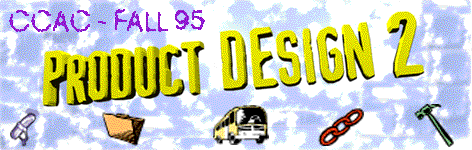

 

# Project II: PyroTechniks Due: Nov. 2

## Scenario

Your head hurts.  You open your eyes to find yourself staring into a face you don’t recognize.  What is going on?  You start to get up and find that the ache isn’t just located in your head.  Your whole body hurts, but nothing seems to be broken.  Suddenly you remember: the jammed controls, the altimeter needle spinning wildly, the rush of the the ground coming at you fast, too terribly fast.

The face you don’t recognize is attached to a body which is urging (more like dragging) you to your feet.  You comply as best you can and stumble out the doorway into the night.  Your guide grabs your arm and leads you past other huts, and down a long heavily-wooded path.  There is no moon, and especially under the trees, the night is dark as ink.  Suddenly the path widens and you find yourself in a kind of natural ampitheater lit by a single fire in the center.  

Your are made to sit.  The arena is filled with people listening to rhythmic, hypnotic music.  You watch as one after another of the listeners  moves to a pile of objects, chooses a few, and begins to dance with them around the fire.  Each dancer is greeted by cheers and jeers.  Suddenly hands thrust you to your feet and you realize you are expected to dance.  In a flash you understand that this may be your only chance.  If you choose your props carefully you will be able to use them to put out the fire.  Then you will be able to escape in ensuing confusion and darkness.

## Challenge

Design and construct a device that dances towards and puts out a candle.

## Rules

- Each class member must design his or her own device
- After motion is initiated neither the device nor the candle may be touched by a human
- Each device must start outside the arena
- Each device will have exactly 3 minutes, including set up time, to complete its dance and put out the candle.
- Device must be powered by stored mechanical energy; no chemical or electrical power

## Materials

Materials are limited to the following:

- Music--cassette cued to correct start or CD
- Foamcore--One 32”x40” sheet per person
- String--20 feet
- Fabric--any color or material, 1 yard max.
- P.V.C. Tubing--5’x 1” 
- Rubber Bands--10 
- Hot Melt or White Glue
- Standard Paper Clip--3 
- Balloon--only one, any size
- Feathers--as many as you want 
- Plastic bottle--2 liter, empty!
- Metal washers, nuts and bolts---as many as you want
- One undergarment [clean]

## Evaluation

Project evaluation will be based on the following:

- Best Dance--based on rythmn, variety of movement, and synchronicity with your music 
- Best Drama--judged by most oohs and aahs.
- Best Engineering--judged from considerations of strength, function, construction
- Most Elegant--judged from number of “Gee, I wish I’d thought of that!” heard
- Best Effort--awarded to most spectacular failure

## Idea Log

Maintain an idea log as a record of everything: your thoughts, ideas, design con- cepts, and directions.  Be prolific in your use of sketches and diagrams to develop your ideas and record your test results.  The log must include at least one final, complete, descriptive sketch of your device and its mechanism.  

**Your log must be handed in on presentation day and will be evaluated based on:**
- Fluency--the sheer number of communicative sketches generated
- Flexibility--the number of different ideas, approaches, tests, and failures documented
- Completeness--thoroughness of design exploration, variety of alternatives explored at all phases of the process 
- Drawing--the range of techniques used in developing your ideas from quick thumbnails to ideas sketches to detailed construction drawings

