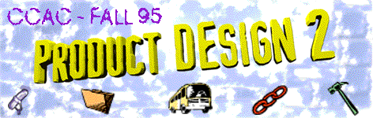

 

# Project III: Hipster

## Background

What do a scuba diver, a carpenter, a telephone lineman, and Batman have in common?  It’s not a skintight suite, even though those PG&E uniforms are kind of cute.  No, ladies  and gentlemen, the answer is  . . . a utility belt.  Yes, that is the defining similarity, the core of commonality, the central theme which unites theses disparate toilers--it’s the belt that binds.

And holds.  The utility belt, the locus for the tools of the trade, is a crucial form of mobile storage.  Without it, our heros and heroines would have their hands full.  And the needed shark knife, level, pliers, or Bat Boomerang would be back in the truck (or Batmobile).

A utility belt is made for working.  It’s not an object of fashion (though the weightlifter’s belt is close to the crossover point).  It’s not for holding up pants, or holding back girth.  Nope, the utility belt is there because the job wouldn’t get done without it.

## Brief

And now you have a job to do.  Design a utility belt designed for a particular kind of work.  In your design consider the nature of the work, the environment in which it is done, the tasks involved in that work, the tools required, and the kind of person who does the work.  

## Goals

In any product design project, your goals are to

- identify the context
- understand the user
- explore the need
- create a solution

This project is no different.  Your belt is going to have a particular job to for a particular kind of person.  You will need to prove that 

1) you understand the job (the context).
1) you know who does the job (the user).
1) you understand the subtleties and difficulties involved in doing the job (the need).
4) you have an opinion about how to do that job (the solution).

## Schedule
You will present your understanding to us in the following way.

### The Need - 16 November

You will have **5 minutes** to explain the need you have chosen.  You should describe to us the job, the tools required to do the job, and a particular person known to you who does this job.  We do not want to see any examples of your design at this point, we want to know that you have found a direction and are pursuing research.  Present your research visually; show more than tell.
#### Deliverables 
- A **two paragraph** document (any document longer than one page will not be accepted) 
  - paragraph one: a statement of the design problem you have chosen 
  - paragraph two: description and contact information for your user
- You do **not** turn in, but should complete, a project schedule by this point.
- A **5 minute** presentation documenting visually the context you have chosen and that you have spoken with your user.

### The Prototypes - 5 December

You will have **5 minutes** to show the directions your design is taking.  At this point you should have mock-ups, and prototypes to show.  You should show us the results of some tests.  You should have feedback from a user which you can share with us.  You should have one question that we can help you answer.
#### Deliverables 
- **Ten** pages (8.5” x 11”) of thumbnail sketches showing design ideas, tools used in the job your belt is for, issues of movement and appearance for the user, environment in which job is performed, etc.
- **Five** presentation-level concept drawings of five different belt solutions
- A **5 minute** presentation documenting the tasks involved in the work for which your belt is designed, the prototypes you have made, and the testing you have done.

### The Solution - 14 December

You will have **10 minutes** to present your design problem, process, and solution.  You should have a final prototype that embodies all of your design concepts.  If this is not feasible you may show us an ID looks-like model, and a PD works-like prototype.  You will need to prove that you have tested your solution with an actual user and you will need to present to us their response to your design.  Tell us a story; make us believe you chose a compelling problem, and arrived at a brilliant solution.
#### Deliverables 
- A final ID model
- One colored paper rendering of your design, mounted on a board
- Orthographic control drawings of your design with overall dimensioning
- Your design log.  This must be in a bound format; loose papers or papers in folders will **not** be accepted.  Your log should document your design process, interviews with your user, testing, schedules, task lists, budgets, and research.
- A **10 minute** presentation of your design problem, process, and solution.  Your presentation will need to document testing and feedback on your design from your user. 

